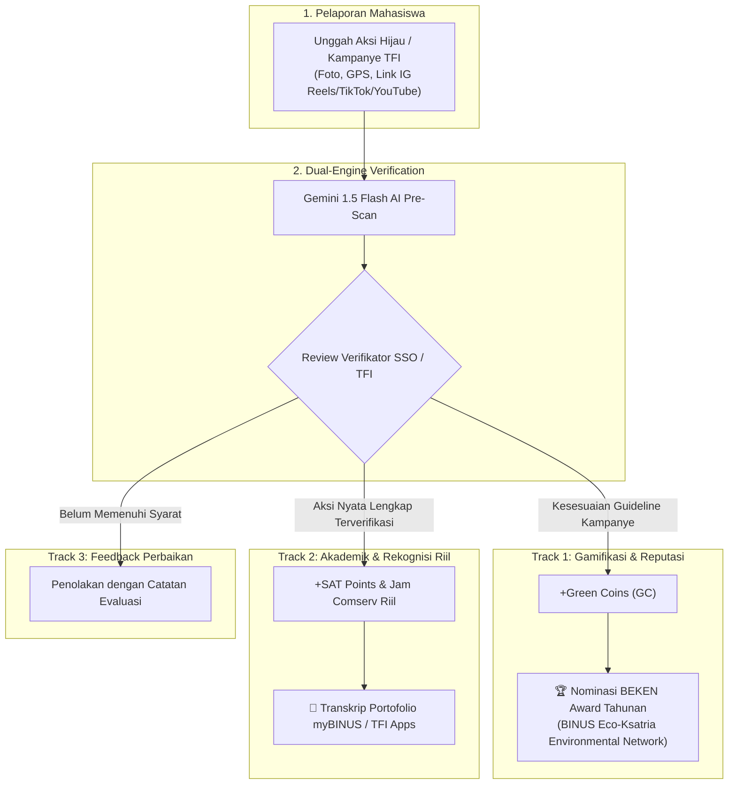

# 🌱 I-CAN (Integrated Gamified Carbon-Neutral Campus Platform)

> **Platform Aksi Iklim Mahasiswa Terintegrasi: Ubah Kebiasaan Hijau & Pengabdian TFI Menjadi Poin SAT dan Perolehan BEKEN Award.**

[](https://react.dev/)
[](https://www.typescriptlang.org/)
[](https://vitejs.dev/)
[](https://tailwindcss.com/)
[](https://logto.io/)
[](https://supabase.com/)
[](https://aistudio.google.com/)
[]()

---

## 📖 1. Brief Project & Latar Belakang

**I-CAN** adalah platform pelaporan aksi berkelanjutan berbasis web (Progressive Web App) yang dirancang khusus untuk mahasiswa **Universitas Bina Nusantara (BINUS)**, selaras dengan standar **Student Service Office (SSO)** dan program resmi **Teach For Indonesia (TFI)**.

### 🔄 Paradigma Dual-Track System (Sesuai Regulasi SSO & TFI):
Sesuai arahan regulasi kampus, perolehan Poin SAT *(Student Activity Transcript)* dan jam *Community Service* **tidak boleh berasal dari konversi skor/koin arbitrer**. Oleh karena itu, I-CAN menerapkan arsitektur **Dual-Track**:



### 3 Pilar Strategis Platform:
1. **Kemudahan & Kemandirian:** Mahasiswa dapat merencanakan dan melaporkan aksi secara mandiri dari smartphone.
2. **Kuantifikasi Dampak SDG Kampus:** Menghitung pengurangan emisi karbon (kg CO2e) dan memetakan aksi ke target UN SDG (SDG 13, 15, 6, 4, 12, 11) secara saintifik (IPCC/GHG Protocol).
3. **Storytelling & Konten Digital:** Mengarsipkan karya edukatif mahasiswa (Video Based Learning & Social Media Campaign) dengan hashtag resmi `#TeachForIndonesia #FosteringandEmpowering #BinusianCommunityService`.

---

## ⚡ 2. Minimal Setup untuk Build Awal (Quick Start Clone Repo)

Aplikasi telah dilengkapi **Zero-Config Mock Mode**. Anda dapat menjalankan dan mendemokan seluruh fitur secara 100% lokal tanpa perlu membuat akun cloud apa pun terlebih dahulu.

### Prasyarat:
- **Node.js:** Versi 18.0.0 atau lebih baru ([Download Node.js](https://nodejs.org/))
- **Git:** Terpasang di komputer Anda

### Langkah-langkah Menjalankan:

```bash
# 1. Clone repository
git clone https://github.com/username/i-can-app.git
cd i-can-app

# 2. Install dependensi
npm install

# 3. Salin environment configuration template
cp .env.example .env

# 4. Jalankan development server
npm run dev
```

Buka browser Anda di **`http://localhost:5173`**.

### Akun Demo Bawaan (Pre-seeded Credentials):
Anda dapat login langsung atau menggunakan tombol **1-Click Demo Reviewer** di halaman login:
- **Mahasiswa (Student):**
  - NIM / Email: `2602158890` atau `budi.santoso@binus.ac.id`
  - Kata Sandi: `binus123`
- **Verifikator (SSO/TFI Admin):**
  - NIM / Email: `2501987654` atau `siska.amanda@binus.ac.id`
  - Kata Sandi: `verifier123`

---

## ⚙️ 3. Panduan Setup Konfigurasi Eksternal (Opsional untuk Produksi/Live)

Jika Anda ingin menghubungkan aplikasi ke backend cloud riil, ubah file [`.env`](file:///.env) dengan langkah berikut:

### A. Konfigurasi Logto SSO (Single Sign-On OIDC)
1. Buka [Logto Cloud Console](https://cloud.logto.io/) dan buat tenant baru.
2. Masuk ke menu **Applications** $\rightarrow$ **Create Application** $\rightarrow$ Pilih **Single Page App (SPA)**.
3. Daftarkan URL:
   - **Redirect URI:** `http://localhost:5173/callback` (Local) dan `https://<domain-anda>/callback` (Production).
   - **Post Sign-out Redirect URI:** `http://localhost:5173/login` (Local) dan `https://<domain-anda>/login` (Production).
4. Salin data ke `.env`:
   ```env
   VITE_LOGTO_ENDPOINT=https://<tenant-id>.logto.app/
   VITE_LOGTO_APP_ID=<app-id-anda>
   ```

### B. Konfigurasi Supabase (Database PostgreSQL 15 & Storage)
1. Buat project baru di [Supabase Dashboard](https://supabase.com/dashboard).
2. Masuk ke menu **SQL Editor**, buka file [`supabase/schema.sql`](file:///supabase/schema.sql), lalu salin dan eksekusi script tersebut.
3. Masuk ke menu **Storage**, buat bucket baru bernama `action-photos` dan centang opsi **Public Bucket**.
4. Salin URL dan Anon Key dari menu **Project Settings** $\rightarrow$ **API** ke `.env`:
   ```env
   VITE_SUPABASE_URL=https://<project-ref>.supabase.co
   VITE_SUPABASE_ANON_KEY=<anon-key-anda>
   ```

### C. Konfigurasi Google Gemini 1.5 Flash (AI Verification Free Tier)
1. Kunjungi [Google AI Studio](https://aistudio.google.com/) dan buat API Key gratis.
2. Masukkan ke `.env`:
   ```env
   VITE_GEMINI_API_KEY=<gemini-api-key-anda>
   ```

---

## 📊 4. Checklist Status Implementasi & Apa Saja yang Belum Dikerjakan

Berikut adalah audit status pengerjaan proyek:

### ✅ Fitur yang Sudah Selesai (Completed):
- [x] **Setup Pondasi & Desain:** React 18 + Vite + TypeScript + Tailwind CSS Gen-Z Cyber-Eco Theme.
- [x] **Autentikasi Mahasiswa:**
  - [x] Simple Password Auth dengan enkripsi *Web Crypto SHA-256 Digest*.
  - [x] Form Registrasi Mahasiswa (NIM, Nama, Email BINUS, Pilihan Fakultas, Password).
  - [x] Integrasi SDK Logto SSO (`@logto/react`) + Halaman `/callback`.
  - [x] 1-Click Demo Reviewer Switcher (Mahasiswa / Verifikator).
  - [x] Rute terproteksi (`ProtectedRoute`) dan default routing ke `/login`.
- [x] **Pelaporan Aksi & Dynamic Form:**
  - [x] Form dinamis untuk Penanaman Pohon, Lubang Biopori, Wastafel Sanitasi, Video Based Learning (VBL), dan Self Campaign.
  - [x] Kompresi foto otomatis di browser (<200KB) menggunakan HTML5 Canvas.
  - [x] Validasi hashtag resmi TFI & deteksi link media digital (IG Reels, TikTok, YouTube).
- [x] **Pre-Verifikasi AI (Gemini 1.5 Flash):** Analisis visual foto aksi dan rekomendasi skor kesesuaian guideline TFI.
- [x] **Portal Verifikator SSO & TFI:**
  - [x] Antrean verifikasi aksi berstatus `PENDING` dengan filter kategori.
  - [x] Keputusan 3-cabang: *Approve Full (+SAT)*, *Approve Coins Only (+GC)*, atau *Reject with Reason*.
- [x] **Portofolio Wallet & Ekspor Transkrip:**
  - [x] Ringkasan saldo Green Coins untuk nominasi BEKEN Award.
  - [x] Riwayat aksi nyata terverifikasi untuk Poin SAT & Jam Comserv riil.
  - [x] Generator Ekspor Transkrip (format JSON/Teks siap disalin ke myBINUS/TFI Apps).
- [x] **Community Feed & Profile:** Timeline aksi kampus, interaksi reaction/likes, level Eco-Ksatria, dan koleksi 6 rarity badges.

### 🟡 Checklist yang Belum Dikerjakan / Pending (Action Items Selanjutnya):
- [ ] **Deployment Produksi ke Netlify (Sprint 4.2):**
  - [ ] Push commit terbaru ke repository GitHub.
  - [ ] Hubungkan repository ke Netlify Dashboard (file [`netlify.toml`](file:///netlify.toml) sudah tersedia).
  - [ ] Masukkan Environment Variables di dashboard Netlify (`VITE_SUPABASE_URL`, `VITE_LOGTO_ENDPOINT`, dll.).
- [ ] **Konfigurasi Akun Cloud Production (Opsional):**
  - [ ] Memasukkan instance Logto Tenant & Supabase Database produksi asli jika ingin multi-device live persistence.
- [ ] **Uji Coba Pilot Lapangan (Field Testing):**
  - [ ] Uji coba skala terbatas dengan ~20 mahasiswa aktif di kampus BINUS.
  - [ ] Evaluasi efektivitas scanning QR standing banner fisik di area kampus.
- [ ] **Fitur Lanjutan Pasca-MVP (Post-MVP Enhancements):**
  - [ ] Fitur Ekspor Transkrip format PDF resmi bertanda tangan digital QR.
  - [ ] Webhook sinkronisasi langsung ke database SSO / TFI Apps (jika izin IT kampus telah diperoleh).

---

## 📁 5. Struktur Folder Project

```
i-can-app/
├── docs/                             # Dokumentasi regulasi & MVP checklist
│   ├── FEATURE_REVISION_NOTES.md     # Catatan regulasi SSO & TFI v2.0
│   ├── MVP_IMPLEMENTATION_CHECKLIST.md # Checklist 4-Sprint
│   └── idea_revision.md              # Rincian latar belakang perubahan alur
├── public/                           # Aset statis & logo
├── src/
│   ├── components/                   # Komponen antarmuka (Card, Button, Badge, Nav)
│   │   └── common/
│   │       ├── BottomNav.tsx         # Navigasi bawah mobile
│   │       ├── ProtectedRoute.tsx    # Guard autentikasi rute
│   │       └── TopNavbar.tsx         # Navbar atas & header
│   ├── pages/                        # Layar aplikasi utama
│   │   ├── CallbackPage.tsx          # OIDC redirect handler Logto
│   │   ├── FeedPage.tsx              # Community Feed & Storytelling
│   │   ├── HomePage.tsx              # Dashboard utama & live ticker
│   │   ├── LoginPage.tsx             # Halaman login, registrasi & demo
│   │   ├── ProfilePage.tsx           # Profil NIM & koleksi badge
│   │   ├── UploadPage.tsx            # Form pelaporan aksi & AI scan
│   │   ├── VerificationPage.tsx      # Portal review verifikator SSO/TFI
│   │   └── WalletPage.tsx            # Portofolio SAT & transkrip
│   ├── services/                     # Layanan API & Autentikasi
│   │   ├── actionService.ts          # Layanan data aksi & verifikasi
│   │   ├── authService.ts            # Enkripsi sandi SHA-256 & registrasi
│   │   ├── gemini.ts                 # Integrasi Google Gemini 1.5 Flash
│   │   ├── logto.ts                  # Konfigurasi Logto OIDC SSO
│   │   └── supabase.ts               # Koneksi Supabase SDK & Storage
│   ├── stores/                       # Zustand state stores (authStore.ts)
│   ├── types/                        # Definisi tipe TypeScript data models
│   ├── utils/                        # Kalkulator karbon & kompresor gambar
│   │   ├── carbonCalc.ts             # Formula emisi saintifik IPCC/GHG
│   │   └── imageCompressor.ts        # Canvas compressor <200KB
│   ├── App.tsx                       # Root routing & layout wrapper
│   ├── main.tsx                      # Entry point React
│   └── index.css                     # Tailwind design system tokens
├── supabase/
│   └── schema.sql                    # Skema database PostgreSQL 15 & RLS
├── .env.example                      # Template variabel environment
├── netlify.toml                      # Konfigurasi build & hosting Netlify
├── package.json                      # Dependensi proyek
├── tailwind.config.js                # Konfigurasi color tokens & styles
└── tsconfig.json                     # Konfigurasi TypeScript
```

---

## 🛠️ 6. Skrip Perintah (Scripts)

| Perintah | Fungsi |
| :--- | :--- |
| `npm run dev` | Menjalankan local development server dengan hot-reload (Vite). |
| `npm run build` | Menjalankan type-checking TypeScript dan membuat build produksi di folder `/dist`. |
| `npm run preview` | Menjalankan server lokal untuk melihat hasil build produksi. |

---

## 📄 Lisensi

Proyek ini dikembangkan untuk inisiatif keberlanjutan kampus **Universitas Bina Nusantara (BINUS)** di bawah lisensi MIT.
