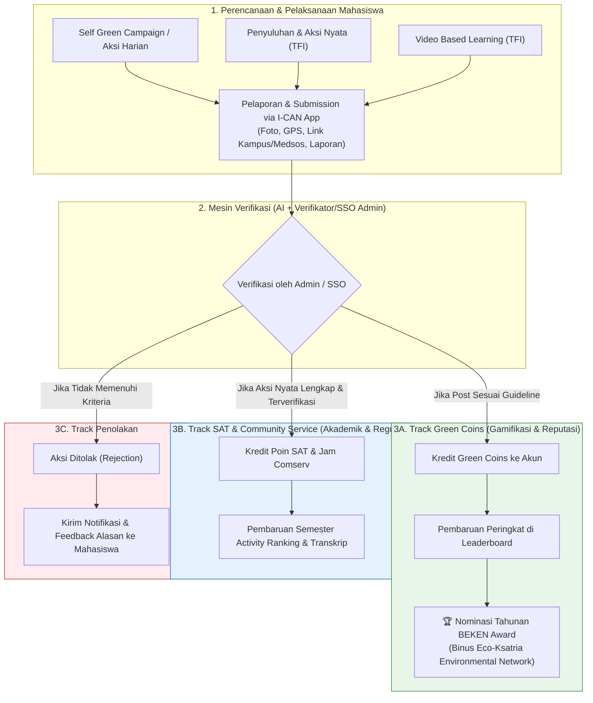

# 📋 CATATAN REVISI FITUR & PROSES BISNIS I-CAN
> **Versi Dokumen:** 2.0  
> **Tanggal Pembaruan:** 21 Agustus 2026  
> **Dasar Perubahan:** Regulasi Student Service Office (SSO) & Acuan Program Teach For Indonesia (TFI)  
> **Status:** Approved for Architecture & Implementation Update  

---

## 📌 1. Latar Belakang & Alasan Perubahan (Core Problem & Context)

Berdasarkan hasil koordinasi dan arahan terbaru dari tim kolaborator **Student Service Office (SSO)** dan regulasi **Teach For Indonesia (TFI)**:
1. **Regulasi Konversi SAT / Community Service:**
   - Pemberian poin SAT *(Student Activity Transcript)* maupun jam *Community Service* **tidak diperbolehkan jika hanya didasarkan pada konversi skor/koin arbitrer** (misal: mengumpulkan 50 koin lalu ditukar menjadi 1 poin SAT tanpa kejelasan aktivitas nyata).
   - Setiap poin SAT dan jam pengabdian masyarakat **wajib dipetakan langsung dan diverifikasi dari kegiatan/aksi nyata yang riil dilaksanakan oleh mahasiswa**.
2. **Kebutuhan Standardisasi Sesuai Guideline TFI:**
   - Aktivitas sosial dan lingkungan mahasiswa harus mengacu pada standar resmi TFI, seperti program **Penyuluhan dan Aksi Nyata** serta **Video Based Learning (VBL)**.
3. **Penguatan 3 Pilar Strategis Platform I-CAN:**
   - **Kemudahan & Kemandirian:** Mahasiswa dapat merencanakan, melaksanakan, dan melaporkan kegiatan/kampanye secara mandiri melalui aplikasi.
   - **Kuantifikasi & Monitoring SDG Kampus:** Dampak lingkungan dan sosial (pengurangan emisi CO2e, pohon tertanam, biopori terpasang, dll.) terukur secara saintifik dan termonitor real-time untuk mendukung pemeringkatan SDG kampus.
   - **Storytelling & Digital Content Creation Archive:** Melatih mahasiswa membuat konten kampanye edukatif berkualitas di media sosial dan mengarsipkan dampaknya secara terstruktur di repository digital kampus BINUS.

---

## 🔄 2. Pergeseran Paradigma: Before vs After

| Aspek | Konsep Lama (v1.0) | Konsep Baru (v2.0) — Sesuai Regulasi |
| :--- | :--- | :--- |
| **Mekanisme Poin SAT** | Arbitrary Currency Exchange: Mahasiswa menukar saldo Green Coins menjadi SAT Point via kalkulator konversi ($50\text{ GC} \rightarrow 1\text{ SAT}$). | **Direct Activity Mapping:** Poin SAT dan jam Community Service diberikan langsung per aksi nyata yang diverifikasi lengkap oleh Admin/SSO. |
| **Fungsi Green Coin** | Mata uang virtual untuk ditukarkan ke SAT Point. | **Gamification & Engagement Token:** Green Coins merepresentasikan *eco-reputation* untuk kompetisi Leaderboard, perolehan Badge, dan **nominasi tahunan BEKEN Award (BINUS Eco-Ksatria Environmental Network Award)**. |
| **Alur Reward (Dual-Track)** | Single track: Aksi $\rightarrow$ Koin $\rightarrow$ Convert ke SAT. | **Dual-Track Outcome:** Verifikasi menentukan reward secara independen: 1. *Guideline Followed* $\rightarrow$ Green Coins + Leaderboard + BEKEN Award. 2. *Action Complete* $\rightarrow$ SAT Points + Semester Activity Ranking. |
| **Kategori Aksi** | Kategori umum sederhana (Tumbler, Bus, Sampah, Listrik). | **Standardisasi TFI & SDG Campaigns:** 1. *Self Green Campaign* (Aksi harian kampus). 2. *Penyuluhan & Aksi Nyata* (Pohon, Biopori, Sanitasi). 3. *Video Based Learning* (Video edukasi 5–10 menit). |
| **Storytelling & Konten** | Opsional/hanya deskripsi teks singkat. | **Terintegrasi:** Wajib menyertakan bukti kampanye media sosial (link IG/TikTok/YouTube) dengan hashtag resmi `#TeachForIndonesia #FosteringandEmpowering #BinusianCommunityService`. |

---

## 🗺️ 3. Alur Proses Bisnis Baru (Dual-Track Flowchart)

---

## 📋 4. Standar & Guideline Kategori Kegiatan (Acuan Resmi TFI)

### A. Kategori 1: Penyuluhan dan Aksi Nyata
Kegiatan langsung yang saling berkaitan antara edukasi publik dan implementasi fisik:
- **Format Partisipasi:** Individu atau Kelompok (Maksimal 3 orang).
- **Sub-Kategori Utama:**
  1. **Penanaman Pohon:**
     - *Penyuluhan:* Social Media Campaign (IG/TikTok reels/foto) edukasi penghijauan & mitigasi bencana dengan hashtag wajib.
     - *Aksi Nyata:* Menanam **minimal 5 bibit pohon berbatang keras** (mangga, alpukat, nangka, tabebuya) di taman kota/sekolah/fasilitas umum.
  2. **Pembuatan Lubang Biopori:**
     - *Penyuluhan:* Social Media Campaign edukasi resapan air & limbah organik.
     - *Aksi Nyata:* Membuat **minimal 5 lubang biopori** di area publik/fasilitas umum dengan melibatkan masyarakat sekitar (RT/RW/penjaga taman).
  3. **Pembuatan Tempat Cuci Tangan / Wastafel:**
     - *Penyuluhan:* Edukasi kebersihan tangan dan pencegahan penyakit menular.
     - *Aksi Nyata:* Pemasangan **minimal 1 instalasi wastafel/sarana cuci tangan** di fasilitas publik yang membutuhkan.
- **Syarat & Ketentuan Validasi:**
  - Pengajuan survei lokasi awal via aplikasi.
  - Wajib kolaborasi dengan masyarakat setempat (dibuktikan dengan foto bersama pengelola/warga).
  - Memperhatikan aspek K3/keamanan (jaringan listrik, pipa gas/air).
  - Batas waktu pelaksanaan maksimal 2 minggu setelah persetujuan pengajuan.
  - Upload laporan akhir dan dokumentasi komprehensif.

### B. Kategori 2: Video Based Learning (VBL)
Video pembelajaran untuk pelajar (SD/SMP/SMA) dan masyarakat umum:
- **Format Partisipasi:** Individu atau Kelompok (Maksimal 3 orang, maks. 2 video/mahasiswa).
- **Durasi Video:** 5 – 10 Menit.
- **Ketentuan Wajib:**
  1. Logo resmi TFI di awal video.
  2. Perkenalan diri (Nama Lengkap, NIM, Jurusan) setelah logo.
  3. Menggunakan **jaket almamater BINUS**.
  4. Konten original, bebas SARA, politik, dan plagiarisme.
  5. Mencantumkan daftar referensi kredibel berstandar **APA Style** di akhir video.
  6. Diunggah ke platform media sosial / Google Drive dan dilaporkan link-nya via aplikasi.

### C. Kategori 3: Self Green Campaign (Aksi Mandiri Harian)
Aksi harian kampus ramah lingkungan:
- Membawa tumbler & wadah makan guna ulang.
- Penggunaan transportasi umum / bus kampus BINUS.
- Pemilahan sampah daur ulang di drop point kampus.
- Kampanye digital hemat energi & sustainability.

---

## 🛠️ 5. Rincian Perubahan Fitur pada Aplikasi I-CAN

### 1. Modul Upload & Pelaporan Aksi (Screen 3)
- **Penambahan Tipe Kegiatan:** Pilihan antara *Aksi Mandiri Kampus*, *Penyuluhan & Aksi Nyata*, atau *Video Based Learning*.
- **Input Storytelling & Multi-Link:** Field untuk memasukkan URL postingan media sosial (Instagram/TikTok), link YouTube/Drive video edukasi, dan hashtag verification.
- **Metadata Kolaborasi:** Field opsional untuk input NIM anggota kelompok (maks 3 orang) dan data mitra masyarakat (misal: Ketua RT, Pengelola Taman).
- **Form Survei Awal (Khusus Aksi Nyata TFI):** Modul registrasi lokasi dan foto survei sebelum aksi dijalankan.

### 2. Modul AI Pre-Verification (Gemini 1.5 Flash)
- **Deteksi Kepatuhan Guideline TFI:**
  - Deteksi visual pemakaian almamater dan logo TFI pada frame video/foto.
  - Pengecekan hashtag wajib pada caption/teks submission: `#TeachForIndonesia`, `#FosteringandEmpowering`, `#BinusianCommunityService`.
  - Verifikasi objek aksi nyata (pohon tertanam, lubang biopori, instalasi wastafel).
- **Pemisahan Rekomendasi AI:** AI memberikan 2 rekomendasi terpisah:
  1. `guideline_compliance_score` (Kelayakan Green Coins).
  2. `activity_completeness_score` (Kelayakan Poin SAT / Jam Comserv).

### 3. Portal Verifikasi Admin / Eco-Volunteer (Screen 4)
- **Tiga Opsi Keputusan Terpisah:**
  1. **Approve Green Coins Only:** Jika konten kreatif dan mengikuti guideline kampanye, tetapi belum memenuhi standar lengkap aksi nyata TFI.
  2. **Approve Full (Green Coins + SAT Point):** Jika aksi nyata atau Video Based Learning memenuhi 100% persyaratan TFI.
  3. **Reject with Reason:** Memberikan feedback langsung kepada mahasiswa jika bukti tidak valid/kurang lengkap.

### 4. Perubahan Modul Wallet menjadi Portofolio & Rekognisi (Screen 5)
- **Dihapus:** Kalkulator konversi koin arbitrer ($50\text{ GC} \rightarrow 1\text{ SAT}$).
- **Ditambahkan:** 
  - **Saldo Green Coins & Estimasi Karbon:** Menampilkan akumulasi koin untuk kompetisi Leaderboard dan nominasi BEKEN Award.
  - **Portofolio SAT & Comserv Terverifikasi:** Daftar kegiatan riil yang telah disetujui beserta rincian poin SAT dan jam Community Service yang diperoleh.
  - **Fitur Ekspor Portofolio / Transkrip Kegiatan:** Menghasilkan ringkasan PDF/JSON kegiatan aksi nyata untuk sinkronisasi ke sistem myBINUS / TFI.

### 5. Seamless & Frictionless Reporting Flow (Kemudahan Pelaporan & Redeem SAT/Comserv)
Untuk mempermudah mahasiswa mendapatkan poin SAT dan jam Community Service secara instan tanpa hambatan birokrasi, alur pelaporan dirancang *frictionless*:
- **Akses Instan via QR Banner / Direct URL:** Mahasiswa dapat langsung mengakses aplikasi web atau memindai kode QR yang tertera pada spanduk/banner/poster kampanye di area kampus.
- **Registrasi Cepat Email BINUS:** Login / onboarding instan berbasis akun email resmi BINUS (`@binus.ac.id`).
- **Auto-Mapping Kategori TFI & Prioritas SDG:** Ketika mahasiswa memilih jenis kegiatan, sistem otomatis memetakan aksi tersebut ke modul program TFI dan target SDG terkait tanpa perlu input manual yang rumit.
- **Form Dinamis Sesuai Jenis Kegiatan:** Formulir secara adaptif menyesuaikan data yang wajib diisi berdasarkan jenis kegiatan yang dipilih (contoh: field kelompok & survei untuk Aksi Nyata, field link durasi untuk Video Based Learning).
- **Drag & Drop & Kamera Langsung:** Foto bukti dapat diunggah dengan cara *drag and drop* atau langsung jepret melalui kamera ponsel.
- **Lampiran Tautan Konten Digital:** Fleksibilitas menyertakan link URL postingan Instagram Reels, TikTok, YouTube, atau Google Drive untuk bukti kampanye storytelling.
- **Transparansi Riwayat Aktivitas (Activity History):** Mahasiswa memiliki dashboard riwayat aktivitas lengkap untuk melacak status verifikasi, feedback admin, dan perolehan poin SAT secara real-time.

### 6. Modul Leaderboard & Rekognisi (Screen 7 & Screen 8)
- **Green Leaderboard:** Peringkat mahasiswa berbasis Green Coins tahunan dengan badge status **"BEKEN Award Nominee"** untuk peringkat teratas.
- **Semester Activity Ranking:** Peringkat keaktifan mahasiswa berbasis akumulasi poin SAT dari aksi nyata per semester.
- **SDG Impact Dashboard:** Grafik agregat kontribusi kampus terhadap target prioritas SDG (SDG 13 Penanganan Perubahan Iklim, SDG 15 Ekosistem Daratan, SDG 6 Air Bersih & Sanitasi, SDG 4 Pendidikan Berkualitas).
- **Storytelling Gallery:** Feed publik karya konten digital dan video edukasi mahasiswa sebagai arsip inspirasi kampus.

---

## 📊 7. Rencana Implementasi & Dampak Dokumen Terkait

Perubahan ini telah diselaraskan ke dalam seluruh dokumen proyek:
1. **TRD (`.ref/TRD_I-CAN_MVP_Architecture.md`):**
   - Arsitektur sistem, skema database (`actions`, `action_categories`, `sat_recognitions`), sequence diagram, dan spesifikasi endpoint API diperbarui.
2. **MVP Implementation Checklist (`docs/MVP_IMPLEMENTATION_CHECKLIST.md`):**
   - Sprint 1–4 dan Definition of Done (DoD) disesuaikan agar fokus pada Dual-Track verification, QR banner onboarding, dynamic form reporting, dan guideline TFI.
