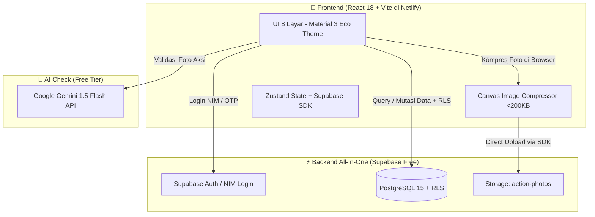
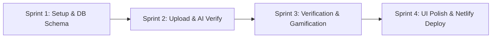

# I-CAN MVP — Lean & Simple Implementation Checklist
> **Platform:** I-CAN (Integrated Gamified Carbon-Neutral Campus Platform)  
> **Target Scale:** Limited Pilot / Demo (~20 active users/day, ~600 actions/month)  
> **Stack:** React 18 + Vite (Netlify) + Supabase (PostgreSQL, Auth, Storage) + Gemini 1.5 Flash  
> **Total Monthly Cost:** **$0.00** (Free Tier dengan buffer keamanan >85%)  
> **Status:** Ready for Fast Execution  

---

## 📊 1. Kalkulasi Ulang Kapasitas & Spek (Skala ~20 User / Hari)

Dengan skala pilot **~20 akses per hari** (~600 aksi/bulan), beban sistem sangat ringan. Seluruh arsitektur kompleks (multi-tier microservices, Cloudflare KV/R2, heavy web workers) **dihilangkan** agar eksekusi cepat dan kode tetap bersih.

| Komponen | Beban Riil (~20 user/hari) | Batas Free Tier | % Pemakaian Free Tier | Status |
| :--- | :--- | :--- | :---: | :---: |
| **Netlify Bandwidth** | ~1.2 GB / bulan | 100 GB / bulan | **1.2%** | 🟢 Sangat Aman |
| **Netlify Build Time** | ~15–30 menit / bulan | 300 menit / bulan | **8.0%** | 🟢 Sangat Aman |
| **Supabase DB Storage** | ~2 MB data relasional | 500 MB | **0.4%** | 🟢 Sangat Aman |
| **Supabase Photo Storage** | ~120 MB (kompresi 200KB/foto) | 1,000 MB (1 GB) | **12.0%** | 🟢 Sangat Aman |
| **Supabase Auth** | ~30–50 akun pilot | 50,000 MAU | **0.1%** | 🟢 Sangat Aman |
| **Gemini 1.5 Flash AI** | ~20–30 request / hari | 15 req/menit (~21,600/hari) | **0.1%** | 🟢 Sangat Aman |

---

## 🏗️ 2. Arsitektur Sederhana (No Bloat, Fast Execution)

### Prinsip Penyederhanaan:
1. **Direct SDK Connection:** Frontend langsung berkomunikasi dengan Supabase melalui `@supabase/supabase-js` dengan proteksi Row Level Security (RLS). Tidak memerlukan server middleware tambahan.
2. **Client-Side Canvas Compression:** Menggunakan elemen `<canvas>` standar browser (15 baris kode) untuk mengompresi foto menjadi WebP/JPEG max 1280px (<200 KB) sebelum upload.
3. **Single-Call AI Verification:** Validasi foto dilakukan dengan 1 pemanggilan langsung ke API Google Gemini 1.5 Flash (gratis via Google AI Studio).
4. **Mock-First Campus Mode:** Fitur validasi NIM dan ekspor SAT Point berjalan 100% lokal dengan data simulasi sehingga tidak bergantung pada izin IT kampus.

---

## 🗺️ 3. Lean 4-Sprint Implementation Checklist

---

### Sprint 1: Setup Proyek & Skema Supabase

- [ ] **1.1 Inisialisasi Frontend**
  - [ ] Setup Vite + React 18 + TypeScript.
  - [ ] Pasang dependensi ringan: `@supabase/supabase-js`, `lucide-react`, `zustand`, `react-router-dom`, `canvas-confetti`.
  - [ ] Setup Tailwind CSS dengan color palette utama (`#1E5631`, `#2E8B57`, `#E5A93C`, `#F8F9FA`).
  - [ ] Simpan file `.env` lokal (hanya butuh 4 variabel: Supabase URL, Anon Key, Gemini Key, Mock Toggle).

- [ ] **1.2 Skema Database Supabase (Jalankan via Supabase SQL Editor)**
  - [ ] Buat 6 tabel esensial:
    1. `users` (id, nim, full_name, email, role: 'STUDENT'/'VERIFIER'/'ADMIN', total_green_coins, total_sat_points, streak_days).
    2. `action_categories` (id, name, type, emission_factor, base_coins, sat_equivalent).
    3. `actions` (id, user_id, category_id, photo_url, story, gps_lat, gps_lng, status: 'PENDING'/'APPROVED'/'REJECTED', ai_confidence, created_at).
    4. `verifications` (id, action_id, verifier_id, status, notes, created_at).
    5. `sat_conversions` (id, user_id, coins_spent, sat_points_added, created_at).
    6. `badges` & `user_badges` (id, name, icon, criteria).
  - [ ] Seed kategori awal (Tumbler, Bus Kampus, Pilah Sampah, Hemat Listrik).
  - [ ] Aktifkan RLS dasar (User hanya bisa edit aksinya sendiri; Verifikator bisa edit status aksi).
  - [ ] Buat bucket storage: `action-photos` (Public).

- [ ] **1.3 Simple Auth & Role Switcher**
  - [ ] Setup `src/services/supabase.ts`.
  - [ ] Buat halaman Login/Onboarding sederhana dengan input NIM & Password / Quick Role Switcher (Mahasiswa / Verifikator) untuk mempermudah demonstrasi juri.

---

### Sprint 2: Upload Aksi Hijau, Kompresi & AI Verification

- [ ] **2.1 Upload Aksi (Screen 3)**
  - [ ] Selector kategori aksi (Grid tombol icon: Tumbler, Transportasi, Sampah, Listrik).
  - [ ] Camera capture / Image picker HTML5.
  - [ ] Helper kompresi gambar berbasis Canvas (`src/utils/imageCompressor.ts`): Resize ke 1280px & convert ke WebP/JPEG max 200KB.
  - [ ] Geolocation extractor (`navigator.geolocation`) untuk menangkap koordinat kampus BINUS.
  - [ ] Input cerita/deskripsi singkat aksi.

- [ ] **2.2 Gemini 1.5 Flash AI Verification**
  - [ ] Helper service `src/services/gemini.ts`:
    - [ ] Kirim foto & kategori aksi ke Gemini Flash API.
    - [ ] Prompt singkat: *"Analisis apakah foto ini sesuai dengan aksi hijau [kategori]. Berikan output JSON { isValid: boolean, confidence: 0-1, reason: string }"*.
  - [ ] Jika `isValid === true` dan `confidence >= 0.85` $\rightarrow$ Tandai aksi sebagai rekomendasi approve; jika ragu $\rightarrow$ Masukkan ke antrean verifikasi manual.

- [ ] **2.3 Direct Storage & DB Insert**
  - [ ] Upload file foto terkompresi langsung ke Supabase Storage `action-photos`.
  - [ ] Insert data aksi ke tabel `actions` dengan status `PENDING`.

---

### Sprint 3: Portal Verifikasi, Gamifikasi & Wallet

- [ ] **3.1 Portal Eco-Volunteer (Screen 4)**
  - [ ] List antrean aksi berstatus `PENDING`.
  - [ ] Detail modal review: Tampilkan foto, lokasi GPS, catatan mahasiswa, dan saran AI confidence.
  - [ ] Tombol **Approve** (Kredit koin otomatis & update status) dan **Reject** (Catat alasan).

- [ ] **3.2 Formula Karbon & Green Coin Ledger**
  - [ ] Helper kalkulasi karbon (`src/utils/carbonCalc.ts`):
    - [ ] Tumbler: 0.05 kg CO2e / 10 Green Coins.
    - [ ] Bus Kampus: 0.12 kg CO2e / 15 Green Coins.
    - [ ] Pilah Sampah: 0.08 kg CO2e / 10 Green Coins.
    - [ ] Hemat Listrik: 0.30 kg CO2e / 20 Green Coins.
  - [ ] Update saldo `total_green_coins` dan `streak_days` saat aksi disetujui.

- [ ] **3.3 Wallet & Konversi SAT Point (Screen 5)**
  - [ ] Tampilan saldo Green Coin & riwayat aksi.
  - [ ] Kalkulator konversi: 50 Green Coins = 1 SAT Point.
  - [ ] Tombol konversi dengan animasi `canvas-confetti` dan update mock balance SAT Point.

---

### Sprint 4: UI Polish (8 Screen design.md) & Netlify Deployment

- [ ] **4.1 Implementasi 8 Screen Sesuai design.md**
  - [ ] **Screen 1: Onboarding & Auth** (Hero illustration, NIM login, role switch).
  - [ ] **Screen 2: Home Dashboard** (Saldo Koin, kg CO2e, SAT Progress bar 45/120, Quick Actions, Streak 🔥).
  - [ ] **Screen 3: Upload Aksi Hijau** (Kamera, GPS tag, AI check preview).
  - [ ] **Screen 4: Status Verifikasi & Review Queue** (State Pending vs State Success Verified).
  - [ ] **Screen 5: Wallet & Convert SAT** (Saldo koin, convert card, riwayat mutasi).
  - [ ] **Screen 6: Community Feed** (Timeline postingan aksi teman kampus + Cheer button).
  - [ ] **Screen 7: Leaderboard** (Podium Top 3, filter Fakultas vs Global, grafik tren Recharts).
  - [ ] **Screen 8: Profile & Badges** (NIM card, koleksi badge, tombol Apply Eco-Volunteer).

- [ ] **4.2 Netlify Deployment (1-Click Setup)**
  - [ ] Pastikan `netlify.toml` berada di root directory.
  - [ ] Jalankan `npm run build` untuk memverifikasi tidak ada error TypeScript.
  - [ ] Push ke GitHub $\rightarrow$ Hubungkan ke Netlify Dashboard.
  - [ ] Masukkan environment variables di Netlify (`VITE_SUPABASE_URL`, `VITE_SUPABASE_ANON_KEY`, `VITE_GEMINI_API_KEY`).
  - [ ] Test live URL di smartphone (tambahkan ke Home Screen sebagai PWA).

---

## 🎯 Definition of Done (DoD) untuk Demo MVP

1. [ ] Pengguna dapat login dengan NIM dan memilih role (Mahasiswa / Verifikator).
2. [ ] Mahasiswa berhasil mengambil foto, foto otomatis terkompresi (<200KB), dan tersimpan di Supabase Storage.
3. [ ] Gemini Flash memberikan analisis validasi kesesuaian foto secara otomatis.
4. [ ] Verifikator dapat menyetujui aksi di halaman antrean review.
5. [ ] Saldo Green Coin bertambah dan kalkulasi kg CO2e ditampilkan di Dashboard.
6. [ ] Fitur convert 50 Green Coins $\rightarrow$ 1 SAT Point berhasil dijalankan.
7. [ ] Aplikasi live di Netlify, responsif di HP, dan 100% gratis ($0).
