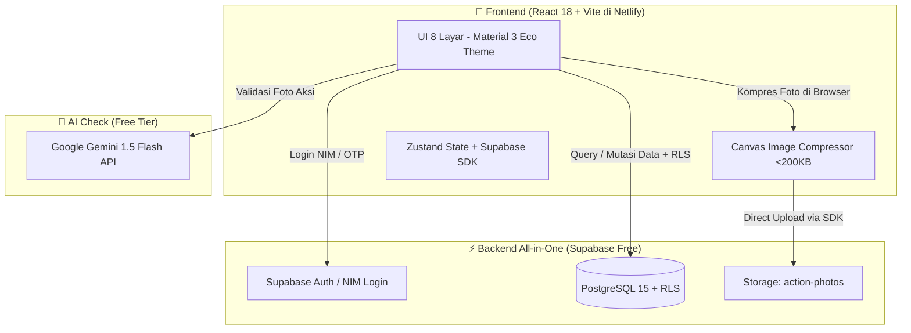
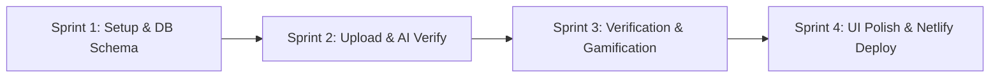

# I-CAN MVP — Lean & Simple Implementation Checklist
> **Platform:** I-CAN (Integrated Gamified Carbon-Neutral Campus Platform)  
> **Target Scale:** Limited Pilot / Demo (~20 active users/day, ~600 actions/month)  
> **Stack:** React 18 + Vite (Netlify) + Supabase (PostgreSQL, Auth, Storage) + Gemini 1.5 Flash  
> **UI/UX Reference:** [design.md](../.ref/design.md) & [Stitch Design System](../.ref/i_can_platform_design_system/stitch_i_can_platform_design_system/i_can_design_specification_design.md)  
> **Total Monthly Cost:** **$0.00** (Free Tier dengan buffer keamanan >85%)  
> **Status:** Sprint 1 Done • Ready for Sprint 2  

---

## 📊 1. Kalkulasi Ulang Kapasitas & Spek (Skala ~20 User / Hari)

Dengan skala pilot **~20 akses per hari** (~600 aksi/bulan), beban sistem sangat ringan. Seluruh arsitektur kompleks (multi-tier microservices, Cloudflare KV/R2, heavy web workers) **dihilangkan** agar eksekusi cepat dan kode tetap bersih.

| Komponen | Beban Riil (~20 user/hari) | Batas Free Tier | % Pemakaian Free Tier | Status |
| :--- | :--- | :--- | :---: | :---: |
| **Netlify Bandwidth** | ~1.2 GB / bulan | 100 GB / bulan | **1.2%** | 🟢 Sangat Aman |
| **Netlify Build Time** | ~15–30 menit / bulan | 300 menit / bulan | **8.0%** | 🟢 Sangat Aman |
| **Supabase DB Storage** | ~2 MB data relasional | 500 MB | **0.4%** | 🟢 Sangat Aman |
| **Supabase Photo Storage** | ~120 MB (kompresi 200KB/foto) | 1,000 MB (1 GB) | **12.0%** | 🟢 Sangat Aman |
| **Supabase Auth** | ~30–50 akun pilot | 50,000 MAU | **0.1%** | 🟢 Sangat Aman |
| **Gemini 1.5 Flash AI** | ~20–30 request / hari | 15 req/menit (~21,600/hari) | **0.1%** | 🟢 Sangat Aman |

---

## 🏗️ 2. Arsitektur Sederhana (No Bloat, Fast Execution)

### Prinsip Penyederhanaan:
1. **Direct SDK Connection:** Frontend langsung berkomunikasi dengan Supabase melalui `@supabase/supabase-js` dengan proteksi Row Level Security (RLS). Tidak memerlukan server middleware tambahan.
2. **Client-Side Canvas Compression:** Menggunakan elemen `<canvas>` standar browser (15 baris kode) untuk mengompresi foto menjadi WebP/JPEG max 1280px (<200 KB) sebelum upload.
3. **Single-Call AI Verification:** Validasi foto dilakukan dengan 1 pemanggilan langsung ke API Google Gemini 1.5 Flash (gratis via Google AI Studio).
4. **Mock-First Campus Mode:** Fitur validasi NIM dan ekspor SAT Point berjalan 100% lokal dengan data simulasi sehingga tidak bergantung pada izin IT kampus.

---

## 🗺️ 3. Lean 4-Sprint Implementation Checklist

---

### Sprint 1: Setup Proyek & Skema Supabase

- [x] **1.1 Inisialisasi Frontend**
  - [x] Setup Vite + React 18 + TypeScript.
  - [x] Pasang dependensi ringan: `@supabase/supabase-js`, `lucide-react`, `zustand`, `react-router-dom`, `canvas-confetti`.
  - [x] Setup Tailwind CSS dengan color palette utama (`#1E5631`, `#2E8B57`, `#E5A93C`, `#F8F9FA`).
  - [x] Simpan file `.env` lokal (hanya butuh 4 variabel: Supabase URL, Anon Key, Gemini Key, Mock Toggle).

- [x] **1.2 Skema Database Supabase (Jalankan via Supabase SQL Editor)**
  - [x] Buat 6 tabel esensial di `supabase/schema.sql`:
    1. `users` (id, nim, full_name, email, role: 'STUDENT'/'VERIFIER'/'ADMIN', total_green_coins, total_sat_points, streak_days).
    2. `action_categories` (id, name, type: 'SELF_GREEN_CAMPAIGN'/'PENYULUHAN_AKSI_NYATA'/'VIDEO_BASED_LEARNING', sdg_target, emission_factor, base_coins, sat_point_awarded, comserv_hours).
    3. `actions` (id, user_id, category_id, submission_type, photo_url, campaign_url, video_url, group_members, story, gps_lat, gps_lng, status: 'PENDING'/'APPROVED'/'REJECTED', guideline_complied, real_activity_verified, green_coins_earned, sat_points_earned, comserv_hours, created_at).
    4. `verifications` (id, action_id, verifier_id, decision: 'APPROVED_COINS_ONLY'/'APPROVED_FULL'/'REJECTED', notes, rejection_reason, created_at).
    5. `sat_recognitions` (id, user_id, action_id, sat_points_awarded, comserv_hours_awarded, status: 'VERIFIED'/'EXPORTED'/'SYNCED', created_at) — *Direct Activity Mapping sesuai regulasi SSO & TFI*.
    6. `badges` & `user_badges` (id, name, icon, criteria).
  - [x] Seed kategori awal sesuai standar TFI & Green Campaign (Penanaman Pohon, Pembuatan Lubang Biopori, Wastafel/Sanitasi, Video Based Learning, Tumbler, Bus Kampus, Pilah Sampah).
  - [x] Aktifkan RLS dasar (User hanya bisa edit aksinya sendiri; Verifikator/Admin bisa review status aksi).
  - [x] Siapkan definisi storage bucket: `action-photos` (Public).

- [x] **1.3 Simple Auth, QR Banner Onboarding & Role Switcher**
  - [x] Setup `src/services/supabase.ts`.
  - [x] Buat halaman Login/Onboarding (`src/pages/LoginPage.tsx`):
    - [x] Direct URL & QR Code banner entry support (akses instan via scan spanduk kampus).
    - [x] Registrasi/Login identitas email BINUS (`@binus.ac.id`) & NIM.
    - [x] Quick Role Switcher (Mahasiswa / Verifikator / SSO Admin) untuk mempermudah demonstrasi juri.

---

### Sprint 2: Upload Aksi Hijau, Dynamic Reporting & AI Verification

- [x] **2.1 Upload Aksi, Dynamic Form & Storytelling (Screen 3 - Stitch Blueprint)**
  - [x] Auto-mapping kategori ke program TFI & prioritas SDG (SDG 13, 15, 6, 4) secara otomatis saat memilih jenis kegiatan.
  - [x] Dynamic Form adaptif: Form hanya menampilkan field yang relevan sesuai jenis kegiatan yang dipilih.
  - [x] Multi-upload fleksibel: Kamera ponsel langsung & **Drag & Drop** area foto bukti.
  - [x] Lampiran tautan media digital (Instagram Reels, TikTok, YouTube, atau Google Drive) untuk konten Video Based Learning & campaign.
  - [x] Helper kompresi gambar berbasis Canvas (`src/utils/imageCompressor.ts`): Resize ke 1280px & convert ke WebP/JPEG max 200KB.
  - [x] Banner Estimasi Dual-Reward (+Green Coins untuk BEKEN Leaderboard, +SAT Points/Comserv untuk Semester Ranking, kg CO2e).

- [x] **2.2 Gemini 1.5 Flash AI Pre-Verification**
  - [x] Helper service `src/services/gemini.ts` terhubung ke Google AI Studio endpoint (`gemini-1.5-flash:generateContent`).
  - [x] Prompt AI terstruktur untuk validasi visual aksi hijau, deteksi objek TFI (pohon, biopori, wastafel), pemakaian jaket almamater, logo TFI, dan kelayakan hashtag kampanye.
  - [x] Output rekomendasi AI terpisah: `guideline_compliance_score` (Green Coins) dan `activity_completeness_score` (SAT Point).

- [x] **2.3 Direct Storage & DB Insert + Verification Status Screen**
  - [x] Layanan `src/services/actionService.ts` untuk direct upload foto ke bucket Supabase `action-photos` & insert data aksi lengkap dengan metadata TFI.
  - [x] Screen Status Verifikasi (Bento Grid 3 Card: +GC/BEKEN Track, kg CO2e/SDG, +SAT Point/Comserv Track).

---

### Sprint 3: Portal Verifikasi Dual-Track, Gamifikasi & Portofolio SAT

- [ ] **3.1 Portal Eco-Volunteer & SSO Admin (Screen 4)**
  - [ ] List antrean review aksi berstatus `PENDING` dengan filter kategori (Self Campaign vs TFI Aksi Nyata vs VBL).
  - [ ] Detail modal review: Tampilkan foto aksi, link postingan medsos/video, catatan mahasiswa, data kelompok, dan rekomendasi skor AI.
  - [ ] Tiga tombol keputusan verifikasi:
    - **Approve Coins Only** (Kredit Green Coins jika postingan sesuai guideline kampanye).
    - **Approve Full** (Kredit Green Coins + Poin SAT & Jam Comserv untuk aksi nyata lengkap).
    - **Reject** (Catat alasan feedback perbaikan ke mahasiswa).

- [ ] **3.2 Formula Karbon, Kuantifikasi SDG & Green Coin Ledger**
  - [ ] Helper kalkulasi karbon & dampak SDG (`src/utils/carbonCalc.ts`):
    - [ ] Penanaman Pohon: 5.00 kg CO2e / 25 Green Coins / 4 SAT / SDG 15 & 13.
    - [ ] Lubang Biopori: 0.50 kg CO2e / 20 Green Coins / 4 SAT / SDG 15 & 6.
    - [ ] Wastafel / Sanitasi: 0.20 kg CO2e / 20 Green Coins / 4 SAT / SDG 6 & 3.
    - [ ] Video Based Learning: 0.10 kg CO2e / 25 Green Coins / 3 SAT / SDG 4.
    - [ ] Tumbler & Wadah: 0.05 kg CO2e / 10 Green Coins / SDG 12.
    - [ ] Bus Kampus: 0.12 kg CO2e / 15 Green Coins / SDG 11 & 13.
  - [ ] Update saldo `total_green_coins`, `total_sat_points`, dan `streak_days` secara atomik di database.

- [ ] **3.3 Portofolio Aksi & Rekognisi SAT (Screen 5 — Direct Mapping SSO/TFI)**
  - [ ] Tampilan saldo Green Coins untuk kompetisi Leaderboard dan nominasi tahunan **BEKEN Award**.
  - [ ] Daftar Portofolio Aksi Nyata Terverifikasi (Daftar kegiatan TFI yang telah disetujui beserta poin SAT & jam Comserv).
  - [ ] Fitur Ekspor Transkrip Kegiatan / Log Comserv (Format ringkasan terstruktur untuk sinkronisasi myBINUS / TFI Apps).

---

### Sprint 4: UI Polish (8 Screen design.md) & Netlify Deployment

- [ ] **4.1 Implementasi 8 Screen Sesuai design.md**
  - [ ] **Screen 1: Onboarding & Auth** (Hero illustration, NIM login, role switcher).
  - [ ] **Screen 2: Home Dashboard** (Saldo Koin, kg CO2e, SAT Progress bar terverifikasi, Quick Actions TFI, Streak 🔥, Status BEKEN Award).
  - [ ] **Screen 3: Upload Aksi & Storytelling** (Kamera, link medsos TFI, deteksi hashtag AI, preview dual reward).
  - [ ] **Screen 4: Status Verifikasi & Review Queue** (State Pending, Approved Coins, Approved Full, Rejected).
  - [ ] **Screen 5: Portofolio Aksi & Rekognisi SAT** (Saldo Green Coin, riwayat aksi nyata, rincian SAT/Comserv terverifikasi).
  - [ ] **Screen 6: Community Feed & Storytelling Gallery** (Timeline postingan aksi & pameran konten edukatif teman kampus).
  - [ ] **Screen 7: Leaderboard & Semester Activity Ranking** (Green Leaderboard $\rightarrow$ BEKEN Award Nominees vs Semester SAT Ranking).
  - [ ] **Screen 8: Profile & SDG Impact Badge** (NIM card, koleksi badge SDG, rekap kontribusi kampus).

- [ ] **4.2 Netlify Deployment (1-Click Setup)**
  - [ ] Pastikan `netlify.toml` berada di root directory.
  - [ ] Jalankan `npm run build` untuk memverifikasi tidak ada error TypeScript.
  - [ ] Push ke GitHub $\rightarrow$ Hubungkan ke Netlify Dashboard.
  - [ ] Masukkan environment variables di Netlify (`VITE_SUPABASE_URL`, `VITE_SUPABASE_ANON_KEY`, `VITE_GEMINI_API_KEY`).
  - [ ] Test live URL di smartphone (tambahkan ke Home Screen sebagai PWA).

---

## 🎯 Definition of Done (DoD) untuk Demo MVP

1. [ ] Pengguna dapat login dengan NIM dan memilih role (Mahasiswa / Verifikator / SSO Admin).
2. [ ] Mahasiswa berhasil mengupload foto aksi nyata/link konten medsos dengan validasi hashtag resmi TFI.
3. [ ] Gemini Flash memberikan analisis validasi visual kesesuaian guideline TFI dan kelengkapan aksi secara otomatis.
4. [ ] Verifikator/Admin dapat melakukan review dual-track (Approve Coins Only, Approve Full + SAT, Reject with reason).
5. [ ] Saldo Green Coin bertambah untuk Leaderboard BEKEN Award dan Poin SAT bertambah langsung di Portofolio Aksi.
6. [ ] Dashboard menampilkan agregasi pengurangan emisi kg CO2e dan progres SAT dari aksi nyata yang terverifikasi (bebas dari konversi arbitrer).
7. [ ] Aplikasi live di Netlify, responsif di HP, dan 100% gratis ($0).
