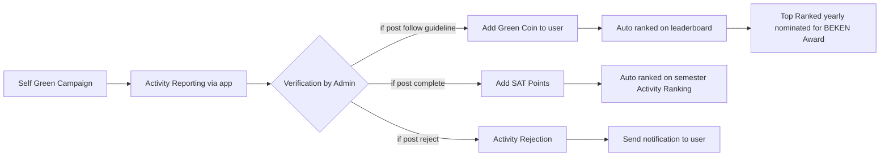

## Business Process Changes (20/08/2026)

1. Arahan dari tim kolaborator Student Service Office memiliki regulasi bahwa konversi tidak memungkinkan dari segi skor saja, harus dipetakan langsung berupa kegiatan yang real dilaksanakan oleh mahasiswa
2. Alur pemanfaatan green coin berubah menjadi sebagai berikut: 



3. Panduan untuk kegiatan yang serupa dan dapat dikonversikan dengan poin SAT/Community Service. ini bukan sebagai tambahan, tetapi sebagai acuan dasar sesuai regulasi dari Teach For Indonesia (TFI): 
```
4. Penyuluhan dan Aksi Nyata 
Penyuluhan dan Aksi Nyata merupakan kegiatan yang dilakukan secara langsung oleh 
mahasiswa untuk memberikan dampak positif dan perubahan bagi komunitas atau 
masyarakat. Kedua kegiatan ini saling berkaitan dan tidak dapat dipisahkan. Contoh kegiatan 
penyuluhan dan aksi nyata: 
a. Penanaman Pohon 
1) Penyuluhan: Edukasi tentang pentingnya penghijauan untuk mengurangi risiko bencana 
alam seperti longsor dan banjir, sekaligus meningkatkan kualitas udara. 
2) Aksi Nyata: Penanaman bibit pohon produktif seperti pohon buah-buahan atau pohon 
pelindung di lokasi strategis seperti lahan kosong atau pinggir jalan. (pembiayaan 
pribadi) 
Contoh: 
Penyuluhan: Mengadakan Social Media Campaign melalui Instagram atau TikTok dalam 
bentuk postingan foto, video, atau reels yang mengedukasi tentang pentingnya 
penanaman pohon. Mahasiswa dapat berkreasi dalam membuat caption yang menarik dan 
informatif dengan menggunakan hashtag #TeachForIndonesia #FosteringandEmpowering 
#BinusianCommunityService. 
Aksi Nyata: Menanam minimal lima (5) bibit pohon berbatang keras (seperti mangga, 
alpukat, nangka, atau tabebuya) di taman kota, sekolah, yayasan, atau fasilitas umum yang 
membutuhkan sebagai upaya penghijauan dan pelestarian lingkungan. 
b. Pembuatan Lubang Biopori 
1) Penyuluhan: Memberikan pemahaman tentang manfaat biopori untuk mengurangi 
genangan air, meningkatkan resapan air tanah, dan mengelola limbah organik. 
2) Aksi Nyata: Melibatkan masyarakat dalam pembuatan lubang biopori di pekarangan 
umum, area publik, atau lahan pertanian.  
Contoh: 
Penyuluhan: Mengadakan Social Media Campaign melalui Instagram atau TikTok dalam 
bentuk postingan foto, video, atau reels yang mengedukasi tentang pentingnya membuat 
lubang biopori. Mahasiswa dapat berkreasi dalam membuat caption yang menarik dan 
informatif dengan menggunakan hashtag #TeachForIndonesia #FosteringandEmpowering 
#BinusianCommunityService. 
11 
Aksi Nyata: Membuat minimal lima (5) lubang biopori di taman kota, sekolah, yayasan, atau 
fasilitas umum yang membutuhkan sebagai upaya meningkatkan resapan air dan 
mengelola limbah organik secara berkelanjutan. 
c. Pembuatan Wastafel/Tempat Cuci Tangan 
1) Penyuluhan: Mengedukasi tentang pentingnya kebersihan tangan dalam mencegah 
penyebaran penyakit, meningkatkan kebersihan dan higienitas, mengurangi risiko 
infeksi saluran pencernaan dan pernapasan, mendukung gaya hidup sehat, serta 
meningkatkan kesadaran akan kesehatan di fasilitas umum yang membutuhkan. 
2) Aksi Nyata: Instalasi wastafel atau tempat cuci tangan sederhana di lokasi strategis, 
seperti sekolah, pasar, atau fasilitas umum. (pembiayaan pribadi) 
Contoh: 
Penyuluhan: Mengadakan Social Media Campaign melalui Instagram atau TikTok dalam 
bentuk postingan foto, video, atau reels yang mengedukasi tentang pentingnya membuat 
wastafel/ tempat cuci tangan. Mahasiswa dapat berkreasi dalam membuat caption yang 
menarik dan informatif dengan menggunakan hashtag #TeachForIndonesia 
#FosteringandEmpowering #BinusianCommunityService. 
Aksi Nyata: Membuat minimal satu (1) wastafel atau tempat cuci tangan di taman kota, 
bakteri dan virus. 
sekolah, yayasan, atau fasilitas umum yang membutuhkan sebagai upaya meningkatkan 
kebersihan, mendukung gaya hidup sehat, serta mencegah penyebaran penyakit akibat 
Syarat dan Ketentuan 
a. Membuat dan mengirimkan pengajuan kegiatan yang berisikan nama anggota, lokasi 
kegiatan, dan foto awal pada saat survey lokasi melalui TFI Apps (Social Innovation Project).  
b. Kegiatan dapat dilakukan secara berkelompok (maksimal 3 orang). 
c. Tempat kegiatan merupakan sarana umum atau fasilitas yang benar-benar membutuhkan. 
d. WAJIB bekerjasama atau melibatkan masyarakat sekitar, seperti tukang kebun, penjaga 
taman, RT/RW, atau pihak lainnya yang dibuktikan dengan dokumentasi berupa foto. 
e. PERHATIKAN FAKTOR KEAMANAN. Diskusi dengan penanggung jawab lokasi terkait kondisi 
lokasi, termasuk apakah terdapat jaringan listrik, pipa gas, saluran air minum, dan lain-lain. 
f. Membuat Laporan Akhir yang dilaporkan melalui TFI Apps (Social Innovation Project). 
g. Setiap mahasiswa hanya dapat mengerjakan 1 kegiatan yang dicontohkan selama menjadi 
mahasiswa Universitas Bina Nusantara. 
h. Batas waktu pelaksanaan kegiatan adalah 2 minggu setelah pengajuan disetujui melalui TFI 
Apps.

---

5. Video Based Learning 
Merupakan video pembelajaran yang diperuntukkan bagi Pelajar (SD, SMP, SMA) dan 
Masyarakat Umum. Materi video pembelajaran meliputi Mata Pelajaran, Hobi dan 
kemampuan atau Informasi Umum. Contoh Kegiatan; Video “Mengenal Tata Surya”; Video 
“Belajar Membuat Pizza”; Video “Bahaya Penyakit Gerd di Usia Remaja”; dan lain-lain. 
Syarat dan ketentuan 
a. Kegiatan dapat dilakukan secara individu atau kelompok (max . 3 orang) dengan batas 
maksimal membuat 2 Video Based Learning untuk setiap mahasiswa,  
b. Tema Video based learning adalah pendidikan formal (Tingkat SD, SMP, SMA) maupun non 
formal (Hobby, Ilmu pengetahuan umum, dan lain-lain), 
c. Mahasiswa mengajukan kegiatan melalui TFI Apps (Social Innovation Project),  
d. Batas waktu Pembuatan Video Based Learning maksimal 3 minggu setelah mendapatkan 
approval di TFI Apps, 
e. Mengirimkan video dalam bentuk link gdrive melalui TFI Apps,  
f. Durasi video antara 5 – 10  menit,  
g. Video yang dibuat wajib memenuhi syarat dibawah ini: 
(Logo TFI), 
1) Logo TFI di awal video (untuk mendapatkan logo TFI, silahkan klik tautan berikut: 
2) Memperkenalkan diri dengan nama lengkap, NIM dan Jurusan setelah logo, 
3) Setiap mahasiswa/ kelompok maksimal dapat membuat 2 video dengan 2 tema yang 
berbeda selama menjadi mahasiswa Universitas Bina Nusantara, 
4) Mahasiswa diwajibkan memakai jaket almamater, 
5) Tidak mengandung unsur Suku, Agama, Ras, dan Antar golongan (SARA) dan politik, 
6) Digital content original, bukan hasil editing dari digital content yang sudah ada, 
7) Cantumkan sumber kredibel yang menjadi acuan pada pembuatan video di akhir video, 
mengikuti APA Style, dan 
8) Video dibuat tanpa bantuan orang lain baik dalam proses pembuatan atau pengeditan. 
Jika terbukti melakukan pelanggaran maka akan dikenakan sanksi yang berlaku sesuai 
dengan PTTAK.  
f. 
Batas waktu melaksanakan kegiatan adalah 2 minggu setelah pengajuan kegiatan 
disetujui melalui TFI Apps.

---


```

4. Dengan aplikasi I-CAN ini harapannya: 1. mahasiswa dapat melakukan activity dan service dengan mudah dan mandiri, 2. SDG prioritas kampus dapat diukur terkuantifikasi dan memonitor capaian SDG kampus, 3. meningkatkan kemampuan storytelling dan digital content creation mahasiswa dalam menyampaikan dampak nyata dari kegiatan mahasiswa agar dapat terpublikasi dengan baik dan ter-arsip dengan baik di BINUS.

5. Reporting ke app:
    - Mahasiswa  dapat langsung akses ke url-nya, atau bisa scan qr di spanduk yang disediakan 
    - mahasiswa  dapat mengisi identitas untuk register sesuai email binus mereka
    - mahasiswa dapat memilih jenis kegiatan apa yang akan mereka laporkan, dan mereka sudah dikategorikan/mapping berdasarkan kegiatan di TFI dan SDG secara nyata dan otomatis saat entry di formnya. 
    - mahasiswa dapat mengisi data-data yang diperlukan sesuai dengan jenis kegiatan yang mereka pilih
    - mahasiswa dapat mengunggah bukti-bukti yang diperlukan
    - foto langsung diupload / drag and drop ke halaman report
    - jika mereka mengunggah video / reels / youtube, bisa link yang diattach di form.
    - mahasiswa dapat melihat history aktivitas mereka