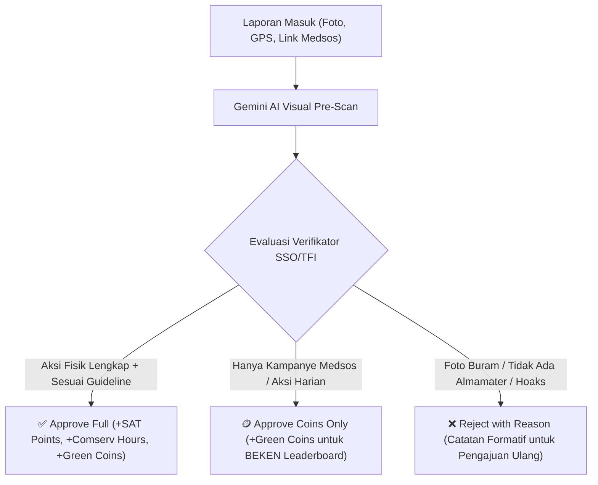

# ⏱️ I-CAN: 5-Minute High-Impact Pitch Deck
## *Panduan Slide & Naskah Presentasi 5 Menit (Innovation Award 2026)*

> **Target Durasi:** Tepat 5 Menit (300 Detik) + Sesi Q&A  
> **Format:** Silicon Valley Accelerator Pitch (Format Y-Combinator / StartX) dengan Bobot Akademis Sistem Informasi  
> **Bahasa:** Bahasa Indonesia Semi-Formal  
> **Target Rilis:** **Output MVP Q4 2026** • **Scale-Up Penuh 2027**  
> **Dasar Revisi:** Per 22 Agustus 2026 (Dual-Track System Murni, Tanpa Konversi Arbitrer Lama)

---

## 🕒 Panduan Manajemen Waktu (Pacing Guide: 300 Detik)

```
========================================================================================
                          TIMELINE 5-MINUTE PITCH (300 DETIK)
========================================================================================
 [Slide 1] 00:00 - 00:40 (40s) : Hook, Visi & Paradoks Aksi Iklim Kampus
 [Slide 2] 00:40 - 01:25 (45s) : Problem: Bottleneck Verifikasi Manual & Regulasi SSO/TFI
 [Slide 3] 01:25 - 02:15 (50s) : Solusi & Novelty: Dual-Track System & Gemini Vision AI
 [Slide 4] 02:15 - 03:00 (45s) : Status Kesiapan: Live Prototype & Arsitektur Zero-Cost
 [Slide 5] 03:00 - 03:45 (45s) : Dampak Terukur: Formula Karbon IPCC & Pemeringkatan Kampus
 [Slide 6] 03:45 - 04:25 (40s) : Roadmap Eksekusi: Output MVP Q4 2026 & Rencana 2027
 [Slide 7] 04:25 - 05:00 (35s) : Call to Action: Sinergi Visi BINUS 2035 & Penutup
========================================================================================
```

---

# DETAIL SLIDE & NASKAH BICARA (SPEAKER SCRIPT)

---

## SLIDE 1: HOOK & VISI BESAR (00:00 - 00:40 | 40 Detik)

### 🖥️ Tampilan di Layar (Slide Content)
- **Judul:** **I-CAN** *(Integrated Gamified Carbon-Neutral Campus Platform)*
- **Tagline:** *Mengubah Aksi Nyata & Pengabdian Mahasiswa Menjadi Rekognisi Akademik yang Terverifikasi.*
- **Visual:** Mockup smartphone PWA memindai aksi lingkungan + Dashboard ESG Kampus BINUS.
- **3 Sorotan Utama:**
  - 🟢 **PWA Mobile:** Scan QR Banner Kampus $\rightarrow$ Lapor dalam 30 Detik.
  - 🤖 **AI Verification:** Pra-analisis visual berbasis Gemini 1.5 Flash.
  - 📜 **Dual-Track:** Poin SAT & Jam Comserv Resmi + Gamifikasi BEKEN Award.

---

### 🗣️ Naskah Presenter (Speaker Script — 40 Detik)
> *"Selamat pagi Dewan Juri yang terhormat. Lebih dari 80% mahasiswa kita memiliki kepedulian tinggi terhadap isu lingkungan dan sosial, namun kurang dari 15% yang aktif mencatat aksinya secara terstruktur. Mengapa? Karena proses pelaporannya manual, birokratis, dan tidak memberikan rekognisi yang instan.*  
> 
> *Inilah alasan kami membangun **I-CAN**—platform aksi iklim kampus generasi baru yang menghubungkan aksi nyata mahasiswa dengan pengakuan akademik resmi, didukung kecerdasan buatan, dan siap meluncur sebagai **MVP pada Kuartal 4 tahun 2026**."*

---

## SLIDE 2: MASALAH & REGULASI KAMPUS (00:40 - 01:25 | 45 Detik)

### 🖥️ Tampilan di Layar (Slide Content)
- **Judul:** Problem: Bottleneck Verifikasi & Kepatuhan Regulasi
- **Visual:** Ilustrasi penumpukan ribuan berkas manual vs aturan ketat akademik.
- **3 Poin Kritis:**
  1. **Administrative Overload:** Staf SSO & TFI butuh 2–4 minggu memverifikasi ribuan foto, almamater, dan mitra secara manual.
  2. **Regulasi Akademik Ketat:** Pemberian poin SAT & Comserv **dilarang menggunakan konversi poin game sembarangan**; wajib dipetakan langsung dari aksi fisik riil.
  3. **Uncaptured Impact:** Ribuan jam aksi lapangan mahasiswa tidak terdata sebagai metrik emisi karbon ($kg\text{ CO}_2e$) untuk pemeringkatan kampus.

---

### 🗣️ Naskah Presenter (Speaker Script — 45 Detik)
> *"Di lapangan, kita menghadapi dua masalah fundamental:*  
> *Pertama, **beban verifikasi manual**. Ketika ribuan mahasiswa mengunggah foto penanaman pohon atau pembuatan biopori, verifikator SSO dan TFI kewalahan memeriksa satu per satu apakah mahasiswa memakai jas almamater atau melibatkan warga sekitar.*  
> 
> *Kedua, **kepatuhan regulasi**. Berdasarkan regulasi resmi kampus, kita tidak boleh sembarangan menukar koin game menjadi nilai akademik SAT. Poin SAT dan jam pengabdian wajib berasal dari aksi nyata yang terbukti valid. Di sinilah inovasi I-CAN berperan."*

---

## SLIDE 3: SOLUSI & NOVELTY — DUAL-TRACK SYSTEM (01:25 - 02:15 | 50 Detik)

### 🖥️ Tampilan di Layar (Slide Content)
- **Judul:** Inovasi Inti: Dual-Track System & AI Vision
- **Visual Diagram:**
```
  [ Laporan Mahasiswa (Foto + GPS + Link Medsos) ]
                         │
           [ Gemini 1.5 Flash Vision AI ]
                         │
             ┌───────────┴───────────┐
   (Track 1: Reputasi Sosial)   (Track 2: Rekognisi Akademik)
   • +Green Coins               • +Poin SAT & Jam Comserv Riil
   • Leaderboard Kampus         • Sesuai Standar Resmi TFI
   • 🏆 Nominasi BEKEN Award    • Terkoneksi myBINUS/TFI Apps
```
- **Kategori Terstandarisasi TFI:**
  - 🌳 *Penanaman Pohon* (Min. 5 bibit keras) | 🕳️ *Lubang Biopori* (Min. 5 lubang aktif)
  - 🚰 *Wastafel Sanitasi* (Min. 1 sarana) | 🎬 *Video-Based Learning* (5–10 Menit format APA)

---

### 🗣️ Naskah Presenter (Speaker Script — 50 Detik)
> *"Inovasi terpenting I-CAN adalah **Dual-Track System**, yang memisahkan jalur akademik dan jalur gamifikasi:*  
> 
> *Saat mahasiswa melapor, **Google Gemini 1.5 Flash Vision AI** melakukan pra-pemeriksaan foto, atribut jas almamater, dan tagar resmi dalam 1,2 detik.*  
> *Lalu sistem memprosesnya ke dua jalur terpisah: **Jalur 1** memberikan Green Coins untuk mengapresiasi kreativitas kampanye menuju penghargaan tahunan **BEKEN Award**. Sementara **Jalur 2** memberikan Poin SAT dan jam Community Service secara langsung berbasis aksi nyata sesuai standar resmi TFI.*  
> 
> *Satu kali lapor, dua manfaat langsung, dan 100% patuh regulasi."*

---

## SLIDE 4: KESIAPAN IMPLEMENTASI & ARSITEKTUR (02:15 - 03:00 | 45 Detik)

### 🖥️ Tampilan di Layar (Slide Content)
- **Judul:** Implementation Maturity: Live Prototype & Zero-Cost Architecture
- **Visual:** Tangkapan layar antarmuka PWA responsif + Panel Super Admin AdminLTE.
- **Metrik Performa Riil:**
  - 📦 **Ukuran Bundel:** 48,2 KB *(Super Lean)* | ⚡ **FCP:** 0,65 detik
  - 🖼️ **Kompresi Canvas:** 5,4 MB $\rightarrow$ 142 KB dalam 180 ms *(Hemat kuota 96%)*
  - 🗄️ **Tech Stack:** React 18, Supabase PostgreSQL 15 (RLS), AdminLTE Portal, Gemini AI
  - 💰 **Biaya Cloud MVP:** **$0,00 / Bulan** *(100% Free-Tier Headroom >88%)*

---

### 🗣️ Naskah Presenter (Speaker Script — 45 Detik)
> *"Bapak/Ibu Juri, I-CAN bukan sekadar rancangan konsep. Platform ini telah terwujud dalam **live working prototype** yang siap diuji.*  
> 
> *Kami membangun arsitektur cerdas: kompresi foto berbasis Canvas di peramban memperkecil ukuran foto dari 5 MB menjadi 140 KB seketika, menghemat 96% beban server. Seluruh data dilindungi keamanan Row Level Security, dan telah dilengkapi **Super Admin Panel bergaya AdminLTE** per revisi 22 Agustus 2026 untuk kemudahan audit data.*  
> 
> *Hebatnya lagi, seluruh fase pilot MVP ini berjalan dengan **biaya infrastruktur $0 alias nol rupiah**."*

---

## SLIDE 5: KUANTIFIKASI DAMPAK SAINTIFIK (03:00 - 03:45 | 45 Detik)

### 🖥️ Tampilan di Layar (Slide Content)
- **Judul:** Scientific Impact: Kuantifikasi Karbon IPCC & Capaian SDG
- **Visual:** Diagram Formula Emisi Karbon + Pemetaan 6 Target UN SDG.
- **Formula & Nilai Terukur:**
  - 🌲 **Tanam Pohon:** $5,00\text{ kg CO}_2e$ / bibit terverifikasi *(IPCC Tier-1 Forestry)* $\rightarrow$ **SDG 13 & 15**
  - 🕳️ **Biopori:** $0,50\text{ kg CO}_2e$ / lubang / bulan *(Penghindaran Metana)* $\rightarrow$ **SDG 15 & 6**
  - 🚰 **Sanitasi:** Higienitas Publik $\rightarrow$ **SDG 6 & 3** | 🎬 **VBL Edukasi:** $\rightarrow$ **SDG 4**
- **Proyeksi 1 Tahun (50.000 Mahasiswa):**
  - 🎯 **$150.000+\text{ kg CO}_2e$** Emisi Ditekan | **$25.000+\text{ Jam}$** Pengabdian TFI | **80%** Beban Verifikator Terpangkas.

---

### 🗣️ Naskah Presenter (Speaker Script — 45 Detik)
> *"Dari sisi keilmuan, I-CAN menggunakan formula saintifik berstandar **IPCC Tier-1 dan GHG Protocol**. Setiap bibit pohon yang ditanam mengikat 5 kg CO2e, dan setiap biopori mencegah emisi metana sebesar 0,5 kg CO2e.*  
> 
> *Artinya, aktivitas mahasiswa tidak hanya menjadi angka di atas transkrip, tetapi teragregasi secara real-time menjadi data emisi kampus yang siap menaikkan skor BINUS University pada pemeringkatan global seperti **THE Impact Rankings** dan **UI GreenMetric**."*

---

## SLIDE 6: ROADMAP EKSEKUSI & RENCANA PROYEK (03:45 - 04:25 | 40 Detik)

### 🖥️ Tampilan di Layar (Slide Content)
- **Judul:** Roadmap Eksekusi: Target MVP Q4 2026 $\rightarrow$ Skala Penuh 2027
- **Visual:** Garis waktu tahapan peluncuran produk.
```
  [ Q4 2026: RILIS OUTPUT MVP ]
  • Pilot Kampus Alam Sutera & Kemanggisan (2.500 Mahasiswa, 50 Verifikator).
  • Operasional PWA 8 Layar, Verifikasi AI Gemini, dan Super Admin Panel.
                │
  [ Q1-Q2 2027: INTEGRASI & MULTI-KAMPUS ]
  • Integrasi API myBINUS & TFI Apps | Ekspansi ke Bandung, Malang, Semarang.
  • Penyelenggaraan 1st Annual BEKEN Award 2027.
                │
  [ Q3-Q4 2027: ENTERPRISE ESG & REPLIKASI NASIONAL ]
  • Dashboard Analitik Keberlanjutan Pimpinan & Blueprint Jaringan Kampus Nasional.
```

---

### 🗣️ Naskah Presenter (Speaker Script — 40 Detik)
> *"Roadmap eksekusi kami sangat terukur dan terencana:*  
> *Pada **Kuartal 4 (Q4) 2026**, kami merilis **Output MVP** untuk uji coba pilot pada 2.500 mahasiswa di kampus Alam Sutera dan Kemanggisan.*  
> 
> *Memasuki tahun **2027**, kami mengintegrasikan API langsung ke myBINUS dan TFI Apps, memperluas layanan ke kampus Bandung, Malang, dan Semarang, serta menggelar BEKEN Award perdana. Di akhir 2027, I-CAN siap menjadi blueprint aksi iklim kampus tingkat nasional."*

---

## SLIDE 7: PENUTUP & CALL TO ACTION (04:25 - 05:00 | 35 Detik)

### 🖥️ Tampilan di Layar (Slide Content)
- **Judul:** Wujudkan Kampus Net-Zero Bersama I-CAN
- **Visual:** QR Code Demo Interaktif + Logo Sinergi BINUS 2035, TFI, dan SSO.
- **Pilar Keselarasan BINUS 2035:**
  - 💚 **Fostering Character:** Membina karakter mahasiswa peduli lingkungan.
  - 🤝 **Empowering Society:** Memberdayakan warga lewat pengabdian TFI.
  - 🇮🇩 **Building the Nation:** Mengarsipkan karya edukasi digital bagi generasi muda.

---

### 🗣️ Naskah Presenter (Speaker Script — 35 Detik)
> *"Sebagai penutup, I-CAN adalah wujud nyata visi BINUS 2035: **Fostering and Empowering the Society in Building the Nation**. Kami membina karakter hijau mahasiswa, memberdayakan masyarakat melalui aksi TFI, dan membangun bangsa lewat inovasi teknologi cerdas.*  
> 
> *Sistem kami telah siap, arsitektur kami telah teruji, dan jadwal rilis MVP kami telah ditetapkan di Q4 2026. Mari bersama I-CAN, kita gerakkan 50.000 Binusian memimpin masa depan Indonesia yang berkelanjutan. Terima kasih."*

---

# SLIDE PENDUKUNG SESI TANYA JAWAB (Q&A BACKUP SLIDES)

---

### Q&A SLIDE A: RINGKASAN 14 REFERENSI ILMIAH UTAMA (KM PORTAL READY)

| Teori & Standar | Peneliti / Sumber Utama | Relevansi Akademik pada I-CAN |
| :--- | :--- | :--- |
| **Self-Determination Theory** | Deci & Ryan (2000) `[1]`; Ryan & Deci (2017) `[2]` | Fondasi pemisahan motivasi intrinsik (Green Coins) dari ekstrinsik (SAT Points). |
| **Task-Technology Fit** | Goodhue & Thompson (1995) `[3]`; Isaac et al. (2019) `[4]` | Desain formulir pelaporan adaptif sesuai jenis tugas lapangan mahasiswa. |
| **D&M IS Success Model** | DeLone & McLean (2003) `[5]`; Petter et al. (2013) `[6]` | Tolak ukur evaluasi kualitas sistem, informasi, dan penerimaan pengguna. |
| **Theory of Planned Behavior** | Ajzen (1991) `[7]`; Yuriev et al. (2020) `[8]` | Landasan fitur interaksi sosial komunitas dan lencana pencapaian. |
| **IPCC Carbon Accounting** | IPCC Refinement Guidelines (2019) `[9]` | Perhitungan sekuestrasi karbon pohon ($5,00\text{ kg CO}_2e$/bibit). |
| **GHG Protocol Standard** | WRI & WBCSD Scope 3 (2020) `[10]` | Perhitungan pencegahan emisi metana pada lubang biopori ($0,50\text{ kg CO}_2e$). |
| **Gamification in Higher Ed** | Hamari et al. (2014) `[11]`; Koivisto & Hamari (2019) `[12]` | Rancangan mekanisme gamifikasi berkelanjutan tanpa inflasi nilai. |
| **SDG Campus Integration** | Leal Filho et al. (2019) `[13]`; Al-Nuaimi et al. (2021) `[14]` | Pengukuran kontribusi nyata kampus terhadap target United Nations SDG. |

---

### Q&A SLIDE B: MATRIKS KEPUTUSAN VERIFIKASI 3-CABANG (VERIFIER TRIAGE)


