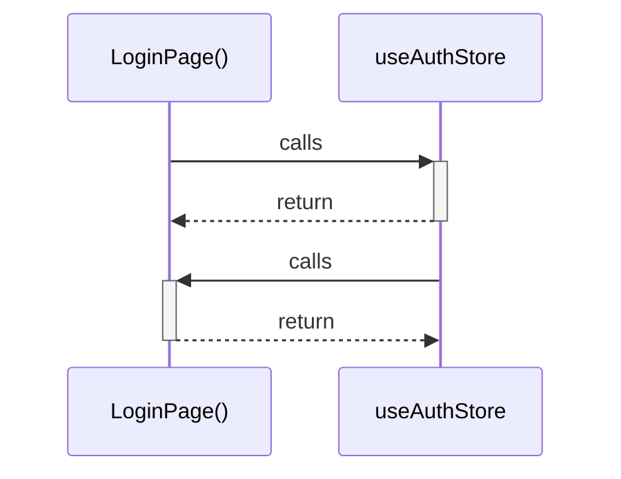

# LoginPage()

> God node · 2 connections · [D:\Codes\i-can-app\src\pages\LoginPage.tsx](file:///D:/Codes/i-can-app/src/pages/LoginPage.tsx#L8)

## Call Trace Diagram

## Connections by Relation

### calls
- [[useAuthStore]] `INFERRED`

### contains
- [[LoginPage.tsx]] `EXTRACTED`

---

*Part of the graphify knowledge wiki. See [[index]] to navigate.*