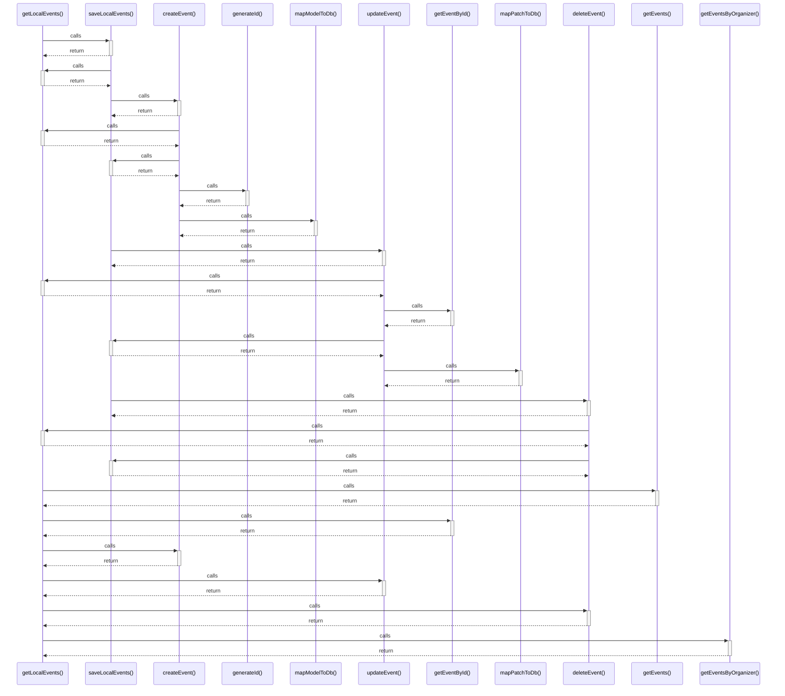

# getLocalEvents()

> God node · 8 connections · [D:\Codes\i-can-app\src\services\eventService.ts](file:///D:/Codes/i-can-app/src/services/eventService.ts#L71)

## Call Trace Diagram

## Connections by Relation

### calls
- [[saveLocalEvents()]] `EXTRACTED`
- [[getEvents()]] `EXTRACTED`
- [[getEventById()]] `EXTRACTED`
- [[createEvent()]] `EXTRACTED`
- [[updateEvent()]] `EXTRACTED`
- [[deleteEvent()]] `EXTRACTED`
- [[getEventsByOrganizer()]] `EXTRACTED`

### contains
- [[eventService.ts]] `EXTRACTED`

---

*Part of the graphify knowledge wiki. See [[index]] to navigate.*