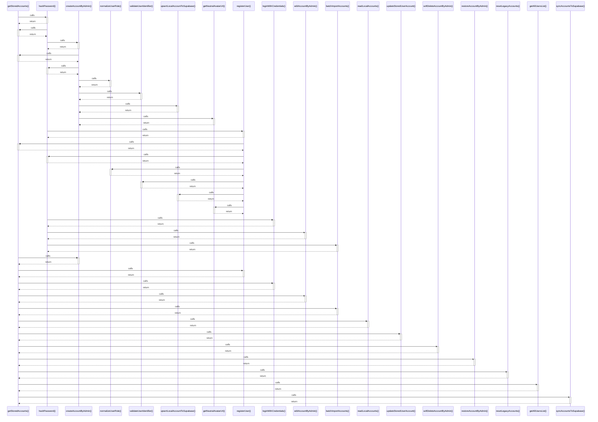

# getStoredAccounts()

> God node · 14 connections · [D:\Codes\i-can-app\src\services\authService.ts](file:///D:/Codes/i-can-app/src/services/authService.ts#L175)

## Call Trace Diagram

## Connections by Relation

### calls
- [[hashPassword()]] `EXTRACTED`
- [[createAccountByAdmin()]] `EXTRACTED`
- [[registerUser()]] `EXTRACTED`
- [[loginWithCredentials()]] `EXTRACTED`
- [[editAccountByAdmin()]] `EXTRACTED`
- [[batchImportAccounts()]] `EXTRACTED`
- [[readLocalAccounts()]] `EXTRACTED`
- [[updateStoredUserAccount()]] `EXTRACTED`
- [[softDeleteAccountByAdmin()]] `EXTRACTED`
- [[restoreAccountByAdmin()]] `EXTRACTED`
- [[resetLegacyAccounts()]] `EXTRACTED`
- [[getAllUsersList()]] `EXTRACTED`
- [[syncAccountsToSupabase()]] `EXTRACTED`

### contains
- [[authService.ts]] `EXTRACTED`

---

*Part of the graphify knowledge wiki. See [[index]] to navigate.*