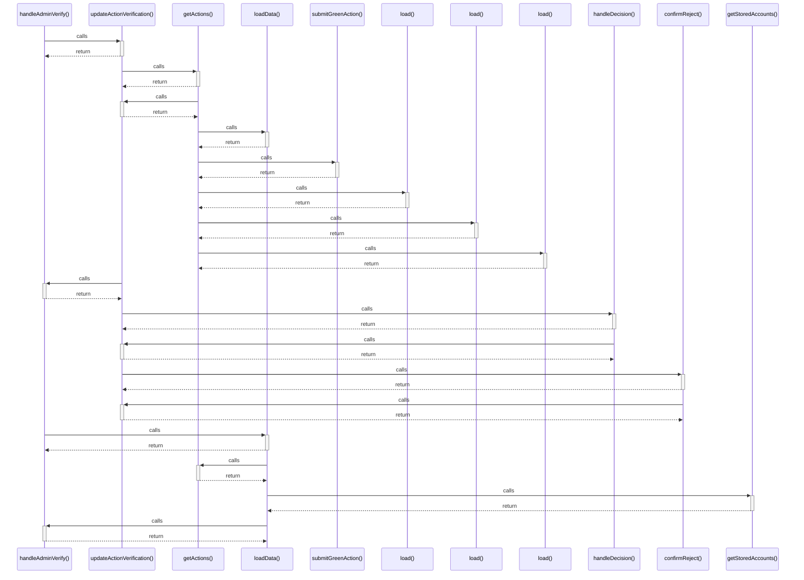

# handleAdminVerify()

> God node · 3 connections · [D:\Codes\i-can-app\src\pages\AdminLtePage.tsx](file:///D:/Codes/i-can-app/src/pages/AdminLtePage.tsx#L83)

## Call Trace Diagram

## Connections by Relation

### calls
- [[updateActionVerification()]] `INFERRED`
- [[loadData()]] `EXTRACTED`

### contains
- [[AdminLtePage.tsx]] `EXTRACTED`

---

*Part of the graphify knowledge wiki. See [[index]] to navigate.*