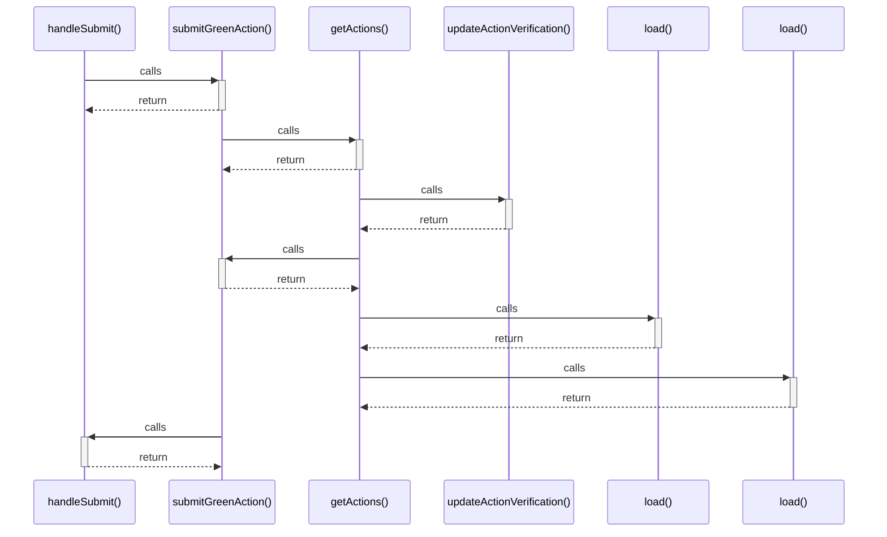

# handleSubmit()

> God node · 2 connections · [D:\Codes\i-can-app\src\pages\UploadPage.tsx](file:///D:/Codes/i-can-app/src/pages/UploadPage.tsx#L169)

## Call Trace Diagram

## Connections by Relation

### calls
- [[submitGreenAction()]] `INFERRED`

### contains
- [[UploadPage.tsx]] `EXTRACTED`

---

*Part of the graphify knowledge wiki. See [[index]] to navigate.*