# Knowledge Graph Index

> Auto-generated by graphify. Start here — read community articles for context, then drill into god nodes for detail.

**453 nodes · 514 edges · 58 communities**

---

## System Architecture Flowchart

```mermaid
flowchart TD
    C0["Community 0 (69 nodes)"]
    C1["Community 1 (46 nodes)"]
    C2["Community 2 (31 nodes)"]
    C3["Community 3 (27 nodes)"]
    C4["Community 4 (26 nodes)"]
    C5["Community 5 (24 nodes)"]
    C6["Community 6 (24 nodes)"]
    C7["Community 7 (23 nodes)"]
    C8["unknown (21 nodes)"]
    C9["Community 9 (16 nodes)"]
    C10["Community 10 (15 nodes)"]
    C11["Community 11 (14 nodes)"]
    C12["Community 12 (11 nodes)"]
    C13["unknown (11 nodes)"]
    C14["unknown (10 nodes)"]
    C15["unknown (7 nodes)"]
    C16["unknown (7 nodes)"]
    C17["unknown (5 nodes)"]
    C18["unknown (5 nodes)"]
    C19["unknown (5 nodes)"]
    C20["unknown (5 nodes)"]
    C21["unknown (4 nodes)"]
    C22["unknown (3 nodes)"]
    C23["Community 23 (3 nodes)"]
    C24["unknown (3 nodes)"]
    C25["Community 25 (3 nodes)"]
    C26["unknown (2 nodes)"]
    C27["unknown (2 nodes)"]
    C28["Community 28 (2 nodes)"]
    C29["unknown (1 nodes)"]
    C30["unknown (1 nodes)"]
    C31["unknown (1 nodes)"]
    C32["unknown (1 nodes)"]
    C33["unknown (1 nodes)"]
    C34["unknown (1 nodes)"]
    C35["Community 35 (1 nodes)"]
    C36["Community 36 (1 nodes)"]
    C37["CSS Class Builder (1 nodes)"]
    C38["Icon Library (1 nodes)"]
    C39["unknown (1 nodes)"]
    C40["Client-side Routing (1 nodes)"]
    C41["Tailwind CSS merge (1 nodes)"]
    C42["Community 42 (1 nodes)"]
    C43["CSS Vendor Prefixing (1 nodes)"]
    C44["Community 44 (1 nodes)"]
    C45["DOM Rendering (1 nodes)"]
    C46["Utility CSS (1 nodes)"]
    C47["Community 47 (1 nodes)"]
    C48["Node Runtime (1 nodes)"]
    C49["React Type Definitions (1 nodes)"]
    C50["React DOM Types (1 nodes)"]
    C51["TypeScript Compiler (1 nodes)"]
    C52["Community 52 (1 nodes)"]
    C53["React bundling (1 nodes)"]
    C54["Community 54 (1 nodes)"]
    C55["Community 55 (1 nodes)"]
    C56["Community 56 (1 nodes)"]
    C57["Community 57 (1 nodes)"]
    C2 -->|1 edges| C9
    C12 -->|1 edges| C3
    C10 -->|1 edges| C3
    C3 -->|1 edges| C1
    C6 -->|1 edges| C1
    C0 -->|1 edges| C14
    C0 -->|1 edges| C19
    C0 -->|1 edges| C1
    C1 -->|1 edges| C7
    C14 -->|1 edges| C0
```

## Communities
(sorted by size, largest first)

- [[Community 0]] — 69 nodes
- [[Community 1]] — 46 nodes
- [[Community 2]] — 31 nodes
- [[Community 3]] — 27 nodes
- [[Community 4]] — 26 nodes
- [[Community 5]] — 24 nodes
- [[Community 6]] — 24 nodes
- [[Community 7]] — 23 nodes
- [[unknown]] — 21 nodes
- [[Community 9]] — 16 nodes
- [[Community 10]] — 15 nodes
- [[Community 11]] — 14 nodes
- [[Community 12]] — 11 nodes
- [[unknown]] — 11 nodes
- [[unknown]] — 10 nodes
- [[unknown]] — 7 nodes
- [[unknown]] — 7 nodes
- [[unknown]] — 5 nodes
- [[unknown]] — 5 nodes
- [[unknown]] — 5 nodes
- [[unknown]] — 5 nodes
- [[unknown]] — 4 nodes
- [[unknown]] — 3 nodes
- [[Community 23]] — 3 nodes
- [[unknown]] — 3 nodes
- [[Community 25]] — 3 nodes
- [[unknown]] — 2 nodes
- [[unknown]] — 2 nodes
- [[Community 28]] — 2 nodes
- [[unknown]] — 1 nodes
- [[unknown]] — 1 nodes
- [[unknown]] — 1 nodes
- [[unknown]] — 1 nodes
- [[unknown]] — 1 nodes
- [[unknown]] — 1 nodes
- [[Community 35]] — 1 nodes
- [[Community 36]] — 1 nodes
- [[CSS Class Builder]] — 1 nodes
- [[Icon Library]] — 1 nodes
- [[unknown]] — 1 nodes
- [[Client-side Routing]] — 1 nodes
- [[Tailwind CSS merge]] — 1 nodes
- [[Community 42]] — 1 nodes
- [[CSS Vendor Prefixing]] — 1 nodes
- [[Community 44]] — 1 nodes
- [[DOM Rendering]] — 1 nodes
- [[Utility CSS]] — 1 nodes
- [[Community 47]] — 1 nodes
- [[Node Runtime]] — 1 nodes
- [[React Type Definitions]] — 1 nodes
- [[React DOM Types]] — 1 nodes
- [[TypeScript Compiler]] — 1 nodes
- [[Community 52]] — 1 nodes
- [[React bundling]] — 1 nodes
- [[Community 54]] — 1 nodes
- [[Community 55]] — 1 nodes
- [[Community 56]] — 1 nodes
- [[Community 57]] — 1 nodes

## God Nodes
(most connected concepts — the load-bearing abstractions)

- [[getStoredAccounts()]] — 14 connections
- [[getActions()]] — 8 connections
- [[getLocalEvents()]] — 8 connections
- [[hashPassword()]] — 7 connections
- [[createAccountByAdmin()]] — 7 connections
- [[registerUser()]] — 7 connections
- [[navigate]] — 6 connections
- [[normalizeUserRole()]] — 6 connections
- [[loginWithCredentials()]] — 6 connections
- [[editAccountByAdmin()]] — 6 connections

---

*Generated by [graphify](https://github.com/safishamsi/graphify)*