# Knowledge Graph Index

> Auto-generated by graphify. Start here — read community articles for context, then drill into god nodes for detail.

**157 nodes · 146 edges · 26 communities**

---

## System Architecture Flowchart

```mermaid
flowchart TD
    C0["Community 0 (26 nodes)"]
    C1["Community 1 (22 nodes)"]
    C2["Community 2 (19 nodes)"]
    C3["Community 3 (10 nodes)"]
    C4["Community 4 (9 nodes)"]
    C5["Community 5 (9 nodes)"]
    C6["Community 6 (8 nodes)"]
    C7["Community 7 (7 nodes)"]
    C8["unknown (7 nodes)"]
    C9["Community 9 (5 nodes)"]
    C10["Community 10 (5 nodes)"]
    C11["Community 11 (5 nodes)"]
    C12["Community 12 (4 nodes)"]
    C13["unknown (3 nodes)"]
    C14["unknown (3 nodes)"]
    C15["unknown (2 nodes)"]
    C16["unknown (2 nodes)"]
    C17["unknown (2 nodes)"]
    C18["unknown (2 nodes)"]
    C19["unknown (1 nodes)"]
    C20["unknown (1 nodes)"]
    C21["unknown (1 nodes)"]
    C22["unknown (1 nodes)"]
    C23["Community 23 (1 nodes)"]
    C24["unknown (1 nodes)"]
    C25["Community 25 (1 nodes)"]
    C0 -->|1 edges| C2
    C5 -->|1 edges| C2
```

## Communities
(sorted by size, largest first)

- [[Community 0]] — 26 nodes
- [[Community 1]] — 22 nodes
- [[Community 2]] — 19 nodes
- [[Community 3]] — 10 nodes
- [[Community 4]] — 9 nodes
- [[Community 5]] — 9 nodes
- [[Community 6]] — 8 nodes
- [[Community 7]] — 7 nodes
- [[unknown]] — 7 nodes
- [[Community 9]] — 5 nodes
- [[Community 10]] — 5 nodes
- [[Community 11]] — 5 nodes
- [[Community 12]] — 4 nodes
- [[unknown]] — 3 nodes
- [[unknown]] — 3 nodes
- [[unknown]] — 2 nodes
- [[unknown]] — 2 nodes
- [[unknown]] — 2 nodes
- [[unknown]] — 2 nodes
- [[unknown]] — 1 nodes
- [[unknown]] — 1 nodes
- [[unknown]] — 1 nodes
- [[unknown]] — 1 nodes
- [[Community 23]] — 1 nodes
- [[unknown]] — 1 nodes
- [[Community 25]] — 1 nodes

## God Nodes
(most connected concepts — the load-bearing abstractions)

- [[navigate]] — 5 connections
- [[getActions()]] — 5 connections
- [[updateActionVerification()]] — 4 connections
- [[hashPassword()]] — 4 connections
- [[getStoredAccounts()]] — 4 connections
- [[useAuthStore]] — 4 connections
- [[submitGreenAction()]] — 3 connections
- [[registerUser()]] — 3 connections
- [[loginWithCredentials()]] — 3 connections
- [[AppLayout]] — 2 connections

---

*Generated by [graphify](https://github.com/safishamsi/graphify)*