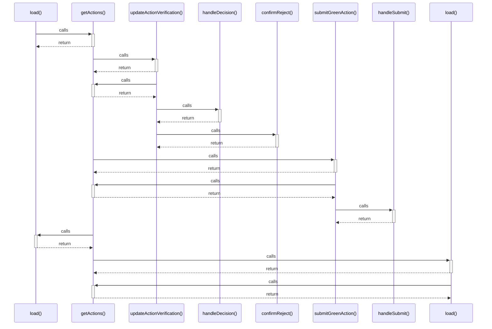

# load()

> God node · 2 connections · [D:\Codes\i-can-app\src\pages\VerificationPage.tsx](file:///D:/Codes/i-can-app/src/pages/VerificationPage.tsx#L109)

## Call Trace Diagram

## Connections by Relation

### calls
- [[getActions()]] `INFERRED`

### contains
- [[VerificationPage.tsx]] `EXTRACTED`

---

*Part of the graphify knowledge wiki. See [[index]] to navigate.*