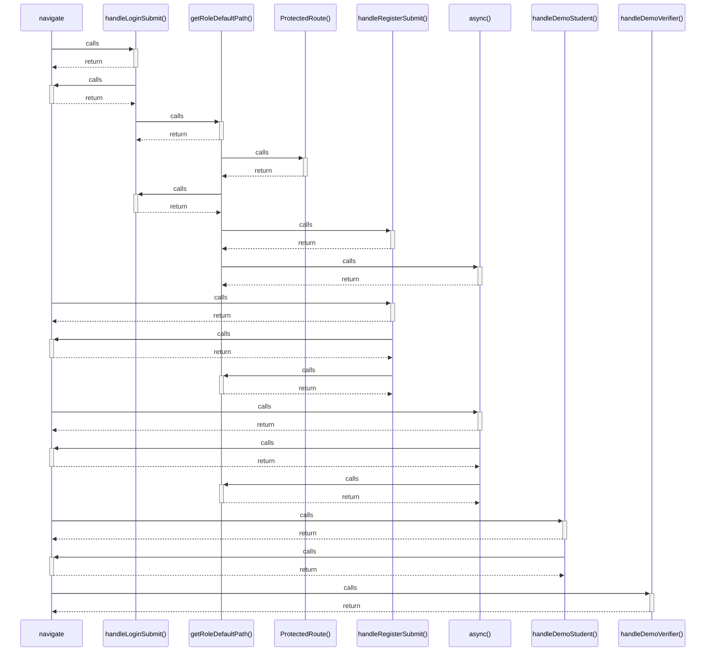

# navigate

> God node · 6 connections · [D:\Codes\i-can-app\src\pages\LoginPage.tsx](file:///D:/Codes/i-can-app/src/pages/LoginPage.tsx#L47)

## Call Trace Diagram

## Connections by Relation

### calls
- [[handleLoginSubmit()]] `EXTRACTED`
- [[handleRegisterSubmit()]] `EXTRACTED`
- [[async()]] `EXTRACTED`
- [[handleDemoStudent()]] `EXTRACTED`
- [[handleDemoVerifier()]] `EXTRACTED`

### contains
- [[LoginPage.tsx]] `EXTRACTED`

---

*Part of the graphify knowledge wiki. See [[index]] to navigate.*