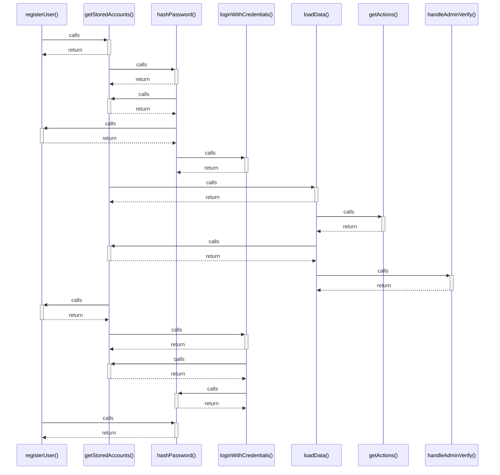

# registerUser()

> God node · 3 connections · [D:\Codes\i-can-app\src\services\authService.ts](file:///D:/Codes/i-can-app/src/services/authService.ts#L159)

## Call Trace Diagram

## Connections by Relation

### calls
- [[getStoredAccounts()]] `EXTRACTED`
- [[hashPassword()]] `EXTRACTED`

### contains
- [[authService.ts]] `EXTRACTED`

---

*Part of the graphify knowledge wiki. See [[index]] to navigate.*