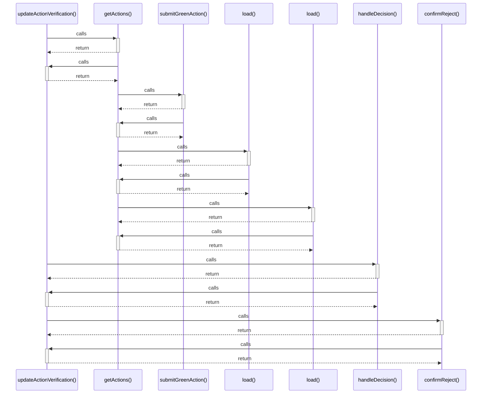

# updateActionVerification()

> God node · 4 connections · [D:\Codes\i-can-app\src\services\actionService.ts](file:///D:/Codes/i-can-app/src/services/actionService.ts#L138)

## Call Trace Diagram

## Connections by Relation

### calls
- [[getActions()]] `EXTRACTED`
- [[handleDecision()]] `INFERRED`
- [[confirmReject()]] `INFERRED`

### contains
- [[actionService.ts]] `EXTRACTED`

---

*Part of the graphify knowledge wiki. See [[index]] to navigate.*