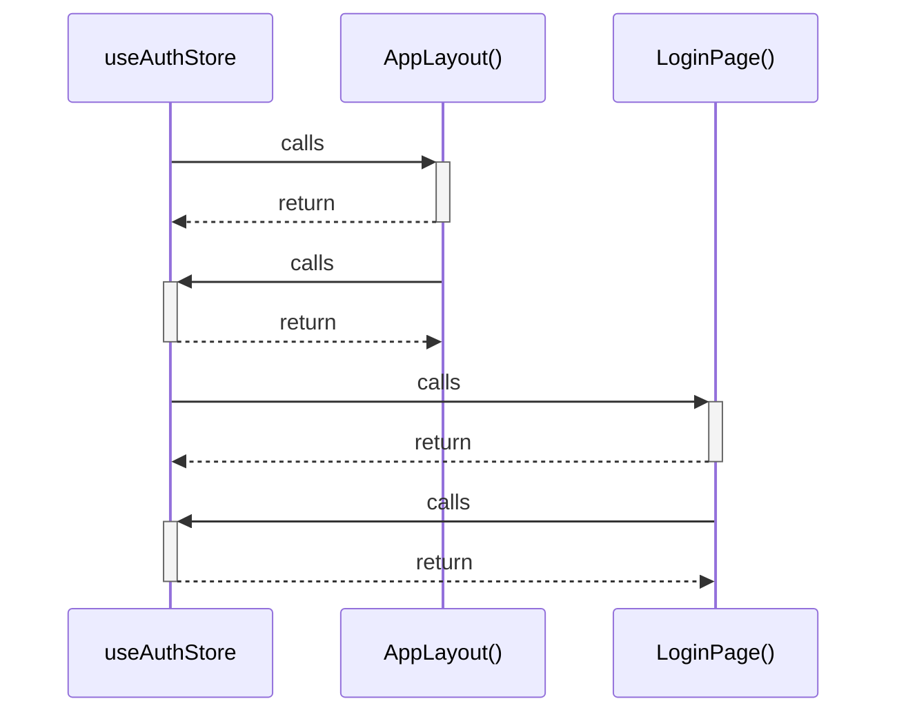

# useAuthStore

> God node · 3 connections · [D:\Codes\i-can-app\src\stores\authStore.ts](file:///D:/Codes/i-can-app/src/stores/authStore.ts#L51)

## Call Trace Diagram

## Connections by Relation

### calls
- [[AppLayout()]] `INFERRED`
- [[LoginPage()]] `INFERRED`

### contains
- [[authStore.ts]] `EXTRACTED`

---

*Part of the graphify knowledge wiki. See [[index]] to navigate.*